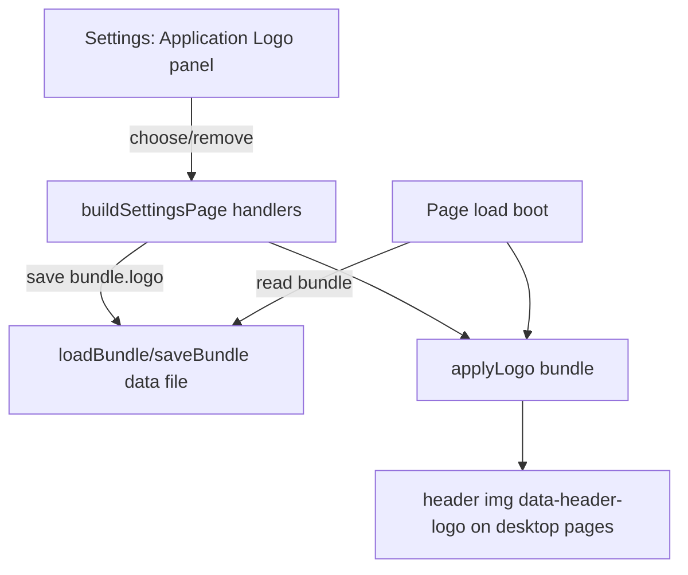

# Requirements

### Overview & Goals
Add a customizable application **logo** that appears in the main site header, positioned at the very left — before the page title (brand), case number, and logged-in username. The logo is managed from the Settings page through a new panel that mirrors the existing **Background Image** panel in look and behavior.

### Scope
#### In Scope
- A logo image displayed at the far left of the header on all desktop pages (`index.html`, `home.html`, `page2.html`–`page8.html`, `page10.html`, `settings.html`).
- A new **Application Logo** panel on the Settings page styled identically to the **Background Image** panel (a `home-panel` with a heading, description, a "Choose Image" upload button, and a reset button).
- Persisting the chosen logo inside the data file/bundle (as a base64 data URL), consistent with how the background image is stored.
- Applying the logo on page load and immediately after it is changed in Settings.

#### Out of Scope
- A bundled default logo asset. Per decision, the reset button **removes** the custom logo rather than reverting to a built-in image.
- Adding the logo to the lightweight `mobile-status.html` and `more.html` headers (they only show a brand title).
- Logo sizing/cropping controls, multiple logos, or per-user logos.

### User Stories
- As an administrator, I want to upload a custom logo so that the header reflects my team/agency branding.
- As an administrator, I want to remove the logo so that the header returns to showing only the title, case number, and username.
- As any user, I want the logo to appear consistently across all main pages so the branding is uniform.

### Functional Requirements
1. The Settings page shows an **Application Logo** panel visually matching the **Background Image** panel (same `home-panel` container, heading, muted description text, `home-actions` row with a `.clear-btn.upload-btn` file input labeled "Choose Image" and a `.clear-btn` reset button labeled "Remove Logo").
2. Choosing an image file reads it as a base64 data URL, saves it into the bundle (`bundle.logo`), and updates the header immediately without a page reload.
3. The reset button clears `bundle.logo` and removes the logo from the header immediately.
4. On every desktop page load, if a logo is set, it is rendered at the far left of the header (before the brand/case/username block); if not set, the logo image is hidden and the header looks exactly as it does today.
5. A status message is shown in the existing settings status area (e.g. "Logo updated and saved." / "Logo removed."), matching the background-image messages.

### Non-Functional Requirements
- Follow the existing base64-in-bundle storage approach; no new backend endpoints or assets required.
- No layout regression on desktop or the existing responsive (`max-width: 860px`) header behavior.
- Reuse existing CSS classes/variables; only add minimal new CSS for logo sizing.

# Technical Design

### Current Implementation
The **Background Image** feature is the reference pattern:
- **Storage:** the chosen image is stored in the bundle as a base64 data URL (`bundle.background`) via `loadBundle()`/`saveBundle()`.
- **Apply function:** `applyBackground(bundle)` in `app.js` (~line 8411) sets `document.body.style.backgroundImage`.
- **Settings wiring:** `buildSettingsPage()` in `app.js` (~lines 8560–8590) wires `#bg-image-input` (`onchange` → `FileReader.readAsDataURL` → save → `applyBackground`) and `#reset-bg-btn` (`onclick` → revert → save → `applyBackground`).
- **Boot:** on load (`app.js` ~line 11674) the app calls `applyTheme(bundle)`, `applyBackground(bundle)`, `applyTipsVisibility(bundle)`, then `updateFileNameDisplay()`.
- **Header markup:** every desktop page has, inside `header > .nav-wrap`, a first `<div>` containing `.brand` (title), a `.file-badge` (Case #), and a `.file-badge[data-user-badge]` (username). `updateFileNameDisplay()` (`app.js` ~line 2599) fills these.
- **Settings panel markup:** `settings.html` lines ~61–73 define the Background Image `home-panel`.
- **CSS:** `.nav-wrap` is `display:flex; align-items:center` and `.nav-wrap > div:first-child` holds the brand block (`styles.css` ~lines 58–72).

### Key Decisions
- **Storage key:** add a new `bundle.logo` field holding a base64 data URL, mirroring `bundle.background`. Rationale: identical persistence/sync behavior as the background, no new infrastructure.
- **Reset = remove:** the reset button sets `bundle.logo` to empty/undefined and hides the header logo (no bundled default asset). Rationale: user-selected behavior; there is no existing default logo image.
- **Header injection via a dedicated element with a stable hook:** add an `` as the first child inside `.nav-wrap` (before the brand block) on each desktop page, hidden by default; `applyLogo()` toggles its `src`/visibility. Rationale: keeps markup static/consistent and lets a single JS function drive all pages, matching how `data-file-name`/`data-username` hooks already work.
- **Scope of pages:** desktop pages only (per decision), matching the pages that show case #/username.

### Proposed Changes
1. **`app.js` — add `applyLogo(bundle)`** (next to `applyBackground`):
   - Select all `[data-header-logo]` elements.
   - If `bundle.logo` is a non-empty string: set `img.src = bundle.logo` and show it (`display:''`).
   - Else: clear `src` and hide it (`display:'none'`).
2. **`app.js` — boot sequence** (~line 11674): call `applyLogo(bundle)` alongside `applyBackground(bundle)`.
3. **`app.js` — `buildSettingsPage()`**: after the background handlers (~line 8590), wire the new logo controls:
   - `#logo-image-input` `onchange`: `FileReader.readAsDataURL(file)` → `nextBundle.logo = e.target.result` → `saveBundle` → `applyLogo(nextBundle)` → status "Logo updated and saved."; reset the input value.
   - `#reset-logo-btn` `onclick`: `nextBundle.logo = ''` → `saveBundle` → `applyLogo(nextBundle)` → status "Logo removed.".
4. **`settings.html` — new panel**: insert an **Application Logo** `home-panel` (styled like the Background Image panel) into the `home-grid`, ideally right after the Background Image panel (~line 73), with `#logo-image-input` (file input, `accept="image/*"`) and `#reset-logo-btn`.
5. **All desktop HTML headers** (`index.html`, `home.html`, `page2.html`–`page8.html`, `page10.html`, `settings.html`): add `` as the first element inside `.nav-wrap`, before the `<div>` brand block.
6. **`styles.css`**: add a small `.header-logo` rule (e.g. fixed max-height ~40px, `width:auto`, `object-fit:contain`, right margin) so the logo sits neatly to the left of the brand block; verify behavior within the existing `@media (max-width:860px)` header rules.

### Data Models / Contracts
```js
// bundle shape addition
bundle.logo = "data:image/png;base64,...."; // or '' / undefined when no logo

// New function
function applyLogo(bundle) {
  const src = bundle && bundle.logo ? bundle.logo : '';
  document.querySelectorAll('[data-header-logo]').forEach((img) => {
    if (src) { img.src = src; img.style.display = ''; }
    else { img.removeAttribute('src'); img.style.display = 'none'; }
  });
}
```

### Components
- **Header logo image** (`[data-header-logo]`) — new element on desktop headers; existing brand/case/username block is unchanged, just shifted right.
- **Application Logo settings panel** (`#logo-image-input`, `#reset-logo-btn`) — new; mirrors the existing Background Image panel.
- **`applyLogo()` / `buildSettingsPage()` / boot** — new function plus edits to existing functions in `app.js`.

### File Structure
- Modified: `app.js` (new `applyLogo`, boot call, settings handlers).
- Modified: `settings.html` (new Application Logo panel).
- Modified: `index.html`, `home.html`, `page2.html`, `page3.html`, `page4.html`, `page5.html`, `page6.html`, `page7.html`, `page8.html`, `page10.html`, `settings.html` (header logo ``).
- Modified: `styles.css` (`.header-logo` styling).

### Architecture Diagram


### Risks
- **Header markup duplicated across many files:** the logo `` must be added to each desktop page identically; missing one leaves that page without a logo. Mitigation: apply the same snippet to all listed files and verify via search.
- **Large base64 images** could bloat the data file; acceptable since it matches the existing background behavior.
- **Responsive header:** ensure the logo does not break the `max-width:860px` wrap layout; constrain height and test.

# Testing

### Validation Approach
Manually load the affected pages in a browser and exercise the Settings panel, verifying header rendering and persistence via the bundle. Confirm behavior matches the existing Background Image feature.

### Key Scenarios
1. **Upload logo:** In Settings, choose an image → header logo appears immediately at the far left, before the title/case/username; status shows "Logo updated and saved.".
2. **Persistence:** Reload the page and navigate to other desktop pages (`home`, `page2`–`page8`, `page10`, `index`) → the logo appears on all of them.
3. **Remove logo:** Click the reset button → logo disappears from the header immediately and on reload; header looks identical to the pre-feature state.
4. **Panel parity:** The Application Logo panel visually matches the Background Image panel (heading, description, buttons layout).

### Edge Cases
- No logo set (fresh bundle): header renders normally with the logo image hidden (no broken image icon).
- Non-image / cancelled file selection: no change, no error thrown; input resets.
- Responsive width (≤860px): header still lays out correctly with the logo present.
- Switching theme/background still works and does not clear the logo (independent bundle fields).

# Delivery Steps

### ✓ Step 1: Add header logo element and styling across desktop pages
Every desktop page header renders a (hidden-by-default) logo image slot at the far left, before the title/case/username block.

- Insert `` as the first child inside `.nav-wrap`, before the brand `<div>`, in `index.html`, `home.html`, `page2.html`–`page8.html`, `page10.html`, and `settings.html`.
- Add a `.header-logo` rule to `styles.css` (constrained max-height ~40px, `width:auto`, `object-fit:contain`, right margin) so it sits neatly left of the brand block.
- Verify the logo slot does not disrupt the existing `@media (max-width:860px)` header layout.

### ✓ Step 2: Implement logo apply logic and boot wiring in app.js
The header logo reflects `bundle.logo` on page load across all pages.

- Add an `applyLogo(bundle)` function in `app.js` next to `applyBackground` that sets/clears `src` and toggles visibility on all `[data-header-logo]` elements based on `bundle.logo`.
- Call `applyLogo(bundle)` in the boot sequence (~line 11674) alongside `applyBackground(bundle)`.
- Ensure an empty/undefined `bundle.logo` hides the image (no broken-image icon).

### ✓ Step 3: Add Application Logo panel to Settings and wire handlers
The Settings page has an Application Logo panel (matching the Background Image panel) that uploads or removes the logo and updates the header live.

- Add an **Application Logo** `home-panel` to `settings.html` (after the Background Image panel) with a `.clear-btn.upload-btn` file input `#logo-image-input` ("Choose Image", `accept="image/*"`) and a `.clear-btn` `#reset-logo-btn` ("Remove Logo"), styled identically to the background panel.
- In `buildSettingsPage()` in `app.js`, wire `#logo-image-input.onchange` to read the file via `FileReader.readAsDataURL`, save it to `bundle.logo`, call `applyLogo`, set status "Logo updated and saved.", and reset the input.
- Wire `#reset-logo-btn.onclick` to clear `bundle.logo`, save, call `applyLogo`, and set status "Logo removed.".