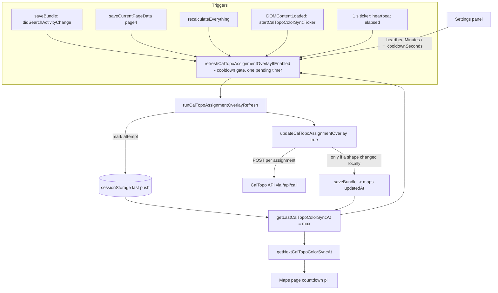

# Requirements

### Overview & Goals
The CalTopo/SARTopo **segment color push** (`updateCalTopoAssignmentOverlay(true)` – PSRc colors, active-search style, finished-task descriptions) currently runs on a fixed 1.2 s debounce every time search data changes. This change turns it into a **rate-limited heartbeat**:

- **Cooldown ("maximum refresh")** – never push more often than every *N seconds* (default **10 s**). Data changes inside the cooldown are coalesced into one push at the end of it.
- **Heartbeat ("minimum refresh")** – push **at least** every *M minutes* (default **1 min**) even when nothing changed, re-asserting the colors on CalTopo.
- **Page switch / recalculation** – if the cooldown has elapsed, a push happens immediately when a page loads or `recalculateEverything()` changes a PSRc.
- A **countdown to the next color sync** is shown next to the map title (map name / id) on the Maps page.
- Both intervals are **user-editable on the Settings page** (minutes for the heartbeat, seconds for the cooldown), stored as per-login preferences like *Par Check Frequency*.

Scope confirmed with the user: only the CalTopo color push is rate-limited. The device↔server `/state` poll (`SYNC_POLL_INTERVAL_MS`) and the outbox flush are **not** touched.

### Scope
**In scope**
- Rate-limiting scheduler around the existing overlay push (`app.js`).
- Heartbeat that always re-pushes every matching assignment shape (user choice: literal "at least every minute").
- Last-push clock kept **on the device** (`sessionStorage`, survives page navigation inside the tab) with the case's `maps[0].caltopoAssignmentOverlayState.updatedAt` used as a hint from other devices (user choice).
- The bundle (heavy `maps` section) is saved by a push **only when a shape's local style/description actually changed**, so heartbeats do not churn `maps` across devices.
- Countdown pill on the Maps page (`#current-map-title` row).
- New Settings panel "CalTopo Color Sync" with two inputs; per-login persistence; `settings_page` mirror.
- Tests, cache-bust `?v=`, `AGENTS.md` + `.junie/plans` record.

**Out of scope**
- Changing the server sync poll interval or outbox behaviour.
- Reloading the CalTopo iframe on every push (CalTopo live-updates its own map; a 10 s iframe reload would be unusable).
- Cross-device agreement of the countdown to the second (devices only share the `updatedAt` hint).
- Removing the manual toggle's immediate push (turning the overlay on/off still pushes at once).

### User Stories
- As a planner, I want segment colors on CalTopo to follow PSRc changes within ~10 s, without flooding CalTopo when I edit several rows in a row.
- As a planner, I want the colors re-asserted every minute so a hand-edit in CalTopo or a missed push never leaves the map stale.
- As a planner on the Maps page, I want to see when the next color sync will happen.
- As a planner, I want to tune both intervals in Settings (e.g. 30 s cooldown / 5 min heartbeat on a slow connection).

### Functional Requirements
1. **Cooldown.** With the overlay on and shapes fetched, a data change that would push (search log edit, team status change, task form edit, PSRc recalculation) pushes immediately if `now - lastPush >= cooldown`; otherwise one push is scheduled for `lastPush + cooldown`. Several changes inside the window produce **one** push.
2. **Heartbeat.** A 1 s ticker pushes when `now - lastPush >= heartbeat` (tab visible only, `document.hidden` skips like `startUnaccountedMapFeatureChecks`). The heartbeat POSTs every matching assignment shape, even if nothing changed.
3. **Page load / navigation.** On every page (after the case is in memory), if `now - lastPush >= cooldown`, push once; otherwise the pending push is scheduled for the cooldown end. Because each page is a full reload, the last-push time is read from `sessionStorage` (per tab) and from `maps[0].caltopoAssignmentOverlayState.updatedAt` (other devices' last *changing* push) – whichever is later.
4. **Recalculation.** `recalculateEverything()` keeps calling the refresh entry point; the scheduler applies the cooldown.
5. **Silence.** Automatic pushes stay silent (console.warn on error) and never open dialogs. A failed attempt still records the attempt time so a failing CalTopo is retried no sooner than the cooldown.
6. **Countdown.** On the Maps page, next to the map title: `Color sync in m:ss` (time to the heartbeat, or to the pending cooldown push when one is scheduled), `Syncing…` while a push is in flight, hidden when the *PSRc Assignment Colors* toggle is off or no shapes are fetched. Updates every second.
7. **Settings.** New panel with *Heartbeat (minutes)* (integer ≥ 1, default 1) and *Cooldown (seconds)* (integer ≥ 1, default 10). Invalid input reverts to the previous value; `cooldown > heartbeat×60` clamps the cooldown to the heartbeat. Changes are logged via `logSettingChange`, saved to the case and to the login preferences, and take effect immediately (next tick).
8. **Defaults preserved.** With no stored setting the behaviour is exactly 10 s / 1 min.

### Non-Functional Requirements
- No case data on the device: only the last-push timestamp goes to `sessionStorage` (an allowed per-tab store, like `sar-open-case-popup`).
- Rendering stays network-silent except for the intentional CalTopo POSTs; a heartbeat with no local change issues **no** `/rows` save.
- Follows AGENTS.md conventions: constants at top of `app.js`, `sanitizeBundle`, `LOGIN_PREFERENCE_KEYS`, `sync-delta.js` `SINGLE_TABLE_KEYS`, `buildStructuredPlan`, `?v=` bump, new test in `package.json`.

# Technical Design

### Current Implementation
- `app.js` `updateCalTopoAssignmentOverlay(enabled)` (~L1440) builds one POST per matching assignment shape, stores `map.caltopoAssignmentOverlayState.updatedAt = Date.now()` and **always** `saveBundle(bundle)` – i.e. every push changes the heavy `maps` section.
- `refreshCalTopoAssignmentOverlayIfEnabled({delay = 1200})` (~L1596) is the silent entry point: checks `isCalTopoAssignmentOverlayEnabled()` (per-login server setting `CALTOPO_ASSIGNMENT_OVERLAY_STORAGE_KEY`), that `maps[0]` has fetched `features`, then debounces `runCalTopoAssignmentOverlayRefresh()` which collapses overlapping runs via `_caltopoOverlayRefreshInFlight/_Pending`.
- Callers: `saveBundle` when `didSearchActivityChange(previous, sanitized)` (~L4896), `saveCurrentPageData` for `page4` (~L5474), `recalculateEverything` (~L5865). `test_caltopo_finished_task_overlay.js` §6 stubs `app.refreshCalTopoAssignmentOverlayIfEnabled` – the name and call sites must stay.
- Maps page: `buildMapsPage()` (~L18745) renders `<h2 id="current-map-title">` (~L18781); `viewMap()` sets its text to `name || id`.
- Settings page: `buildSettingsPage()` – the `parFreqInput` block (~L12320) is the pattern for a numeric per-login setting (`logSettingChange` → `saveBundle` → `persistLoginPreference`). Panel markup in `settings.html` (~L133 *Par Check Frequency*, L145 *Map Feature Check*).
- Per-login preference plumbing: `LOGIN_PREFERENCE_KEYS` (~L2034), `applyLoginPreferencesToBundle`, `saveUserPreferences`. Bundle shape: `defaultBundle()` (~L4219 `parCheckFrequency: 20`), `sanitizeBundle()` (~L4404 / return object ~L4538). Server mirror: `sync-delta.js` `SINGLE_TABLE_KEYS` (L72), `sync-server.js` `buildStructuredPlan` `settings_page` (L664).
- Periodic-task precedent: `startUnaccountedMapFeatureChecks()` (~L19611) – `setInterval` tick, `document.hidden` guard, `*_INTERVAL_MS` constant; started from the `DOMContentLoaded` handler (~L16444).
- Static guard: `test_sync_outbox.js` L276 requires every `*_STORAGE_KEY` / `*_INTERVAL_MS` used in `app.js` to be declared with `const/let/var`.

### Key Decisions
1. **Scope = CalTopo push only** (user). `SYNC_POLL_INTERVAL_MS`, outbox and `/state` untouched.
2. **Clock = device `sessionStorage` + bundle hint** (user). `sessionStorage` survives page navigation inside the tab and is wiped when the tab closes; `maps[0].caltopoAssignmentOverlayState.updatedAt` is read as a lower bound so a device does not re-push seconds after another device's *changing* push. The bundle is **not** saved on a no-change heartbeat.
3. **Heartbeat always re-pushes** (user) – literal "at least every minute"; payloads are POSTed even when identical.
4. **Keep the existing entry point.** `refreshCalTopoAssignmentOverlayIfEnabled()` keeps its name/signature (tests pin it) and becomes the cooldown-aware scheduler; `runCalTopoAssignmentOverlayRefresh()` stays the single executor and records the push time. No second pipeline.
5. **Two bundle keys, per-login preferences**, mirrored exactly like `parCheckFrequency`: `caltopoColorSyncHeartbeatMinutes` (default 1) and `caltopoColorSyncCooldownSeconds` (default 10). Normalisation in one helper so Settings, scheduler and sanitizer agree.
6. **No iframe reload on automatic pushes.** `runCalTopoAssignmentOverlayRefresh` currently tests `typeof refreshCalTopoIframe === 'function'`, which is always false at global scope (it is a closure inside `buildMapsPage`); this dead branch is left as is / removed – a 10 s iframe reload would be unusable.

### Proposed Changes

**Constants (top of `app.js`, next to `MAP_UNACCOUNTED_*`)**
```js
// CalTopo color sync: pushes are coalesced so CalTopo is never asked more often
// than the cooldown, and re-asserted at least once per heartbeat. Defaults used
// when the login has not changed them on the Settings page.
const CALTOPO_COLOR_SYNC_DEFAULT_COOLDOWN_SECONDS = 10;
const CALTOPO_COLOR_SYNC_DEFAULT_HEARTBEAT_MINUTES = 1;
// How often the countdown/heartbeat ticker wakes up.
const CALTOPO_COLOR_SYNC_TICK_INTERVAL_MS = 1000;
// When THIS tab last pushed (or tried to push) the colors. sessionStorage: kept
// across page navigations in the tab, forgotten when the tab closes; never a
// piece of case data.
const CALTOPO_COLOR_SYNC_LAST_PUSH_STORAGE_KEY = 'sar-caltopo-color-sync-last-v1';
```

**Settings helper (near `getSegmentDisplaySettings`)**
```js
function getCalTopoColorSyncSettings(bundle = loadBundle()) {
    // -> {heartbeatMinutes, cooldownSeconds, heartbeatMs, cooldownMs}
    // integers >= 1; cooldownSeconds clamped to heartbeatMinutes*60
}
function normalizeCalTopoColorSyncInterval(value, fallback) { /* parseInt, >=1, else fallback */ }
```

**Bundle plumbing**
- `defaultBundle()`: `caltopoColorSyncHeartbeatMinutes: 1, caltopoColorSyncCooldownSeconds: 10`.
- `sanitizeBundle()`: read both through `getCalTopoColorSyncSettings(bundle)` and return them.
- `LOGIN_PREFERENCE_KEYS`: append both keys (mirrored via `applyLoginPreferencesToBundle`/`persistLoginPreference`).
- `sync-delta.js` `SINGLE_TABLE_KEYS`: both → `'settings_page'`.
- `sync-server.js` `buildStructuredPlan` → `singles.settings_page`: add both fields.

**Scheduler (replaces the body of `refreshCalTopoAssignmentOverlayIfEnabled`, same section of `app.js`)**
```js
let _caltopoColorSyncTimer = null;      // the one pending push (setTimeout)
let _caltopoColorSyncDueAt = 0;         // when that push will run (for the countdown)
let _caltopoColorSyncTicker = null;     // 1 s setInterval

function getLastCalTopoColorSyncAt(bundle) {
    const own = parseInt(sessionStorage.getItem(CALTOPO_COLOR_SYNC_LAST_PUSH_STORAGE_KEY) || '0', 10) || 0;
    const hint = bundle?.maps?.[0]?.caltopoAssignmentOverlayState?.updatedAt || 0;
    return Math.max(own, hint);
}
function markCalTopoColorSyncAttempt(at = Date.now()) { sessionStorage.setItem(KEY, String(at)); }

function canRunCalTopoColorSync(bundle)  // overlay enabled + maps[0].id + features.length (existing guard)

function refreshCalTopoAssignmentOverlayIfEnabled(options = {}) {
    const {delay = 300} = options;              // burst-coalescing debounce only
    if (!canRunCalTopoColorSync(bundle)) return;
    const {cooldownMs} = getCalTopoColorSyncSettings(bundle);
    const earliest = getLastCalTopoColorSyncAt(bundle) + cooldownMs;
    const runAt = Math.max(Date.now() + delay, earliest);
    if (_caltopoColorSyncTimer && _caltopoColorSyncDueAt <= runAt) return; // already scheduled sooner/same
    clearTimeout(_caltopoColorSyncTimer);
    _caltopoColorSyncDueAt = runAt;
    _caltopoColorSyncTimer = setTimeout(runCalTopoAssignmentOverlayRefresh, runAt - Date.now());
}

function getNextCalTopoColorSyncAt(bundle) {
    // pending push if any, else last + heartbeat
}

function startCalTopoColorSyncTicker() {   // called once from DOMContentLoaded next to startUnaccountedMapFeatureChecks()
    if (_caltopoColorSyncTicker) return;
    _caltopoColorSyncTicker = setInterval(caltopoColorSyncTick, CALTOPO_COLOR_SYNC_TICK_INTERVAL_MS);
    // Page just loaded: honour the "push on page switch if the cooldown is over" rule.
    refreshCalTopoAssignmentOverlayIfEnabled({delay: 500});
    caltopoColorSyncTick();
}
function caltopoColorSyncTick() {
    renderCalTopoColorSyncCountdown();                 // Maps page only (no-op elsewhere)
    if (document.hidden) return;
    if (!canRunCalTopoColorSync(bundle) || _caltopoOverlayRefreshInFlight || _caltopoColorSyncTimer) return;
    if (Date.now() - getLastCalTopoColorSyncAt(bundle) >= heartbeatMs) refreshCalTopoAssignmentOverlayIfEnabled({delay: 0});
}
```
- `runCalTopoAssignmentOverlayRefresh()`: clear `_caltopoColorSyncTimer/_DueAt`, call `markCalTopoColorSyncAttempt()` **before** awaiting the push (so a failure is also rate-limited), keep the in-flight/pending collapse; the `pending` re-run goes through `refreshCalTopoAssignmentOverlayIfEnabled()` so it respects the cooldown. Drop the dead `refreshCalTopoIframe` branch.
- `updateCalTopoAssignmentOverlay()`: track `let changedLocally = false;` – set when `originals[styleKey]` is captured for the first time, when `applyCapturedCalTopoFeatureStyle` would alter `feature.attributes` (compare `captureCalTopoFeatureStyle(feature.attributes)` before/after), when `feature.attributes.class` is corrected, or when `nextDescription !== null`. When `enabled`: set `updatedAt` and `saveBundle(bundle)` **only if `changedLocally`**. The disable path is unchanged (always saves/deletes the state). Result gains `{updatedCount, errors, changed: changedLocally}`.

**Maps page countdown (`buildMapsPage`)**
- Markup: wrap the title: `<div style="display:flex;align-items:center;gap:10px;"><h2 id="current-map-title">…</h2><span id="caltopo-color-sync-countdown" class="mini-pill" style="display:none;padding:3px 10px;font-size:0.75rem;" title="Time until the segment colors are next pushed to CalTopo"></span></div>` (reuses the `.mini-pill` used by `#unaccounted-features-count`).
- `renderCalTopoColorSyncCountdown()` (global, no-op if the element is absent): hidden when `!isCalTopoAssignmentOverlayEnabled()` or no fetched features; `Syncing…` while `_caltopoOverlayRefreshInFlight`; otherwise `Color sync in ${formatCountdown(getNextCalTopoColorSyncAt() - Date.now())}` (`m:ss`, floor at `0:00`).
- The overlay toggle's `onchange` and `caltopo_request` completion call `renderCalTopoColorSyncCountdown()` so the pill appears/disappears immediately.

**Settings page**
- `settings.html`: new panel after *Map Feature Check*: `<div class="home-panel" data-setting-scope="login" data-geek-compact data-geek-title="Color Sync"><h2>CalTopo Color Sync</h2><p>…</p>` with two `.home-row`s: `#caltopo-sync-heartbeat-input` (number, min 1, step 1) + label *minutes at most between color pushes*, and `#caltopo-sync-cooldown-input` (number, min 1, step 1) + label *seconds at least between color pushes*, each with `.geek-full`/`.geek-abbr` labels like the Par panel.
- `buildSettingsPage()`: two handlers modelled on `parFreqInput` using `getCalTopoColorSyncSettings`/`normalizeCalTopoColorSyncInterval`, `logSettingChange('CalTopo color sync heartbeat (minutes)' | '… cooldown (seconds)', prev, next, nextBundle)`, `saveBundle`, `persistLoginPreference`, `status.textContent`. If the cooldown ends up clamped, write the clamped value back into the input and say so in the status line.
- Bump `?v=` in every HTML file (`app.js`, `sync-delta.js` changed).

### Data Models / Contracts
```
bundle.caltopoColorSyncHeartbeatMinutes : integer >= 1   (default 1)   // "minimum refresh": push at least this often
bundle.caltopoColorSyncCooldownSeconds  : integer >= 1   (default 10)  // "maximum refresh": never more often than this
                                          invariant: cooldownSeconds <= heartbeatMinutes * 60
sessionStorage['sar-caltopo-color-sync-last-v1'] : epoch ms of this tab's last push attempt
maps[0].caltopoAssignmentOverlayState.updatedAt : epoch ms of the last push that CHANGED a shape locally (existing key, now written only on change)
updateCalTopoAssignmentOverlay(enabled) -> {updatedCount, errors, changed}
```

### File Structure
| File | Change |
|---|---|
| `app.js` | constants; `getCalTopoColorSyncSettings`/`normalizeCalTopoColorSyncInterval`; `defaultBundle`, `sanitizeBundle`, `LOGIN_PREFERENCE_KEYS`; scheduler rewrite (`refreshCalTopoAssignmentOverlayIfEnabled`, `runCalTopoAssignmentOverlayRefresh`, `startCalTopoColorSyncTicker`, `caltopoColorSyncTick`, `getLastCalTopoColorSyncAt`, `getNextCalTopoColorSyncAt`, `renderCalTopoColorSyncCountdown`); `updateCalTopoAssignmentOverlay` save-on-change; `buildMapsPage` pill; `buildSettingsPage` handlers; `DOMContentLoaded` start |
| `settings.html` | new *CalTopo Color Sync* panel |
| `sync-delta.js` | `SINGLE_TABLE_KEYS` two keys |
| `sync-server.js` | `buildStructuredPlan` `settings_page` two fields |
| `*.html` | `?v=` bump |
| `test_caltopo_color_sync_schedule.js` | **new** vm-sandbox test |
| `test_structured_tables.js`, `test_user_preferences_assets.js` | extend existing asserts |
| `package.json` | append the new test |
| `AGENTS.md`, `.junie/plans/caltopo-color-sync-rate-limit.md` | record |

### Architecture Diagram


### Risks
- **Tests that count refresh requests** (`test_caltopo_finished_task_overlay.js` §6 stubs the entry point – unaffected; `test_caltopo_psrc_overlay.js` may await `updateCalTopoAssignmentOverlay` directly – run it and adjust only if it asserts a save on an unchanged push).
- **Sandbox `setTimeout: () => 0`** in existing tests means scheduled pushes never fire there – this matches today's behaviour (the 1200 ms debounce never fired either). The new test supplies a controllable fake clock.
- **Multiple tabs** on one device each keep their own `sessionStorage` clock and may both heartbeat; the bundle hint limits it to no-change pushes. Accepted.
- **Save-on-change detection** must compare captured style before/after; if `applyCapturedCalTopoFeatureStyle` normalises values (e.g. opacity strings), compare via `captureCalTopoFeatureStyle` output with `deepEqual` from `sync-delta.js` to avoid false positives that would re-introduce `maps` churn.
- **Clamping** cooldown to heartbeat must happen in the shared helper, not only in the UI, so a stale preference record cannot yield `cooldown > heartbeat`.

# Testing

### Validation Approach
- `node --check app.js`, `node --check sync-server.js`, `node --check sync-delta.js`.
- New vm-sandbox suite `test_caltopo_color_sync_schedule.js` modelled on `test_caltopo_finished_task_overlay.js` (fake `document`, `SAR_MEMORY_STORAGE`, scripted `fetch` recording POSTs to `/api/call`), plus a **controllable clock**: sandbox `Date.now`, `setTimeout`/`setInterval` implemented as a manual queue advanced by `advance(ms)`, and a fake `sessionStorage`.
- Run the whole chain with `npm test` after appending the new suite to `package.json`.

### Key Scenarios
1. **Burst coalescing** – overlay on, shapes fetched, last push unknown: three `refreshCalTopoAssignmentOverlayIfEnabled()` calls within 300 ms → after `advance(500)` exactly one batch of POSTs (one per matching assignment); `sessionStorage` key set.
2. **Cooldown** – immediately after (1), another refresh request → no POST at `advance(3000)`; POSTs appear once `advance` reaches 10 s after the first push. A third request during the wait does not add a second timer (`_caltopoColorSyncTimer` reused).
3. **Heartbeat, no changes** – with nothing edited, `advance(60_000)` from the last push → POSTs again; the recorded `/rows` requests contain **no** `maps` change (heavy section untouched) and `maps[0].caltopoAssignmentOverlayState.updatedAt` is unchanged.
4. **Heartbeat, with change** – a PSRc-affecting edit that changes a shape's fill → push saves the bundle once and bumps `updatedAt`.
5. **Page load** – new sandbox with `sessionStorage` last push 30 s ago → `startCalTopoColorSyncTicker()` pushes within `advance(600)`; with last push 4 s ago → no push until the 10 s mark. With the bundle hint `updatedAt` 2 s ago and no sessionStorage → no immediate push.
6. **Custom intervals** – bundle `caltopoColorSyncCooldownSeconds = 30`, `caltopoColorSyncHeartbeatMinutes = 5` → cooldown push at 30 s, heartbeat at 300 s.
7. **Countdown text** – `document.body.dataset.page = 'page10'`, element `caltopo-color-sync-countdown` present: text `Color sync in 0:50` after `advance(10_000)` following a push; `display: none` when the overlay toggle is off; `Syncing…` while the POST promise is pending.
8. **Settings normalisation** – `getCalTopoColorSyncSettings` on `{cooldownSeconds: 'abc'}` → 10; `{cooldownSeconds: 90, heartbeatMinutes: 1}` → cooldown 60; `{heartbeatMinutes: 0}` → 1; `sanitizeBundle` round-trips both keys.
9. **Settings page handlers** – in a `settings` sandbox, set `#caltopo-sync-heartbeat-input = 3`, fire `onchange` → bundle key 3, `saveUserPreferences` record contains it, an activity-log entry mentions the setting; cooldown input `120` with heartbeat 1 → clamped to 60 and input value rewritten.

### Edge Cases
- Overlay enabled but `maps[0].features` empty → no timer, no POST, pill hidden.
- `document.hidden = true` → ticker does not heartbeat; a data-change push still runs (unchanged behaviour).
- CalTopo POST rejects → `console.warn`, attempt time recorded, next attempt not before the cooldown.
- `saveBundle` inside a push must not re-trigger a push loop: `didSearchActivityChange` ignores `maps`, verified by asserting one POST batch per cycle.
- Disabling the overlay while a push is pending → timer cleared by the `canRunCalTopoColorSync` guard at run time; pill hidden.

### Test Changes
- **Add** `test_caltopo_color_sync_schedule.js` (+ `package.json` `scripts.test`).
- **Update** `test_structured_tables.js` (`settings_page` captures `caltopoColorSyncHeartbeatMinutes`/`caltopoColorSyncCooldownSeconds`), `test_user_preferences_assets.js` (panel list at ~L593 gains *CalTopo Color Sync*; `pills.length >= 12`).
- **Re-run** `test_caltopo_finished_task_overlay.js`, `test_caltopo_psrc_overlay.js`, `test_caltopo_overlay_opacity.js`, `test_sync_outbox.js` (static `*_STORAGE_KEY`/`*_INTERVAL_MS` guard) and fix only what the save-on-change rule affects.

# Implementation Notes (as built, 2026-09-09)

- `app.js` constants L93–105; helpers `normalizeCalTopoColorSyncInterval` / `getCalTopoColorSyncSettings` right after `getSegmentDisplaySettings`; scheduler block (`loadBundleForCalTopoColorSync`, `getLastCalTopoColorSyncAt`, `markCalTopoColorSyncAttempt`, `canRunCalTopoColorSync`, `clearPendingCalTopoColorSync`, `refreshCalTopoAssignmentOverlayIfEnabled`, `getNextCalTopoColorSyncAt`, `formatCountdown`, `renderCalTopoColorSyncCountdown`, `runCalTopoAssignmentOverlayRefresh`, `caltopoColorSyncTick`, `startCalTopoColorSyncTicker`) replaces the old debounce right after `updateCalTopoAssignmentOverlay`.
- `updateCalTopoAssignmentOverlay(true)` marks the attempt itself too (so the Maps page toggle's manual push also resets the cooldown clock) and saves the case only when `changedLocally`; the style diff is `JSON.stringify(captureCalTopoFeatureStyle(...))` before/after (`deepEqual` was not needed – the captured object has a fixed key order).
- Default burst delay is now 300 ms (was 1200 ms); the page-load request uses 500 ms. The first request of a burst fixes the push time; later requests inside the window fold into it.
- `getElementById` in the vm sandboxes always returns an element, so the countdown tests read the pill via `app.__document.getElementById(...)` after the first render; `buildMapsPage` itself is not run there.
- `test_caltopo_color_sync_schedule.js` has a manual clock (`createClock`): sandbox `Date`, `setTimeout`, `setInterval` are queue-driven and `advance(ms)` drains microtasks between timers.
- Pre-existing uncommitted work by the user was present in `app.js` / `mobile-status.html` / `package.json` (`test_incident_times_days.js`) during this session; it was left untouched and `npm test` passes with both.

# Delivery Steps

### ✓ Step 1: Add the two color-sync interval settings to the bundle and the login preferences
The case and the login record carry `caltopoColorSyncHeartbeatMinutes` (default 1) and `caltopoColorSyncCooldownSeconds` (default 10), normalised by one helper and mirrored to `settings_page`.

- Declare `CALTOPO_COLOR_SYNC_DEFAULT_COOLDOWN_SECONDS`, `CALTOPO_COLOR_SYNC_DEFAULT_HEARTBEAT_MINUTES`, `CALTOPO_COLOR_SYNC_TICK_INTERVAL_MS`, `CALTOPO_COLOR_SYNC_LAST_PUSH_STORAGE_KEY` at the top of `app.js` (with why-comments, matching the `MAP_UNACCOUNTED_*` block).
- Add `normalizeCalTopoColorSyncInterval(value, fallback)` and `getCalTopoColorSyncSettings(bundle)` (integers ≥ 1, cooldown clamped to heartbeat×60, returns `*Ms` too) near `getSegmentDisplaySettings`.
- Add both keys to `defaultBundle()`, `sanitizeBundle()` (read through the helper, include in the returned object) and `LOGIN_PREFERENCE_KEYS`.
- Add both keys to `sync-delta.js` `SINGLE_TABLE_KEYS` → `'settings_page'` and to `sync-server.js` `buildStructuredPlan` `singles.settings_page`.
- Extend `test_structured_tables.js` (`settings_page` captures the two fields) and add sanitizer/normalisation asserts to the new `test_caltopo_color_sync_schedule.js` skeleton (vm sandbox with fake clock, `sessionStorage`, recorded `fetch`); append it to `package.json` `scripts.test`.

### ✓ Step 2: Turn the overlay refresh into a cooldown/heartbeat scheduler
CalTopo receives the color push at most once per cooldown and at least once per heartbeat, on data changes, page loads and the 1 s ticker, with the last-push time kept in `sessionStorage` plus the bundle's `updatedAt` hint.

- Rewrite `refreshCalTopoAssignmentOverlayIfEnabled(options)` in `app.js` as the cooldown gate: one pending `setTimeout` (`_caltopoColorSyncTimer`, `_caltopoColorSyncDueAt`) scheduled at `max(now + delay, lastPush + cooldownMs)`; keep the name/signature and the existing enabled/map/features guard (`canRunCalTopoColorSync`).
- Add `getLastCalTopoColorSyncAt(bundle)` (max of `sessionStorage` key and `maps[0].caltopoAssignmentOverlayState.updatedAt`), `markCalTopoColorSyncAttempt()`, `getNextCalTopoColorSyncAt(bundle)`.
- Update `runCalTopoAssignmentOverlayRefresh()`: clear the pending timer, mark the attempt before awaiting, route the `_caltopoOverlayRefreshPending` re-run through the gate, remove the dead `refreshCalTopoIframe` branch.
- Add `startCalTopoColorSyncTicker()` / `caltopoColorSyncTick()` (1 s `setInterval`, `document.hidden` guard, heartbeat when `now - last >= heartbeatMs`, immediate page-load request when the cooldown is over) and call it from the `DOMContentLoaded` handler next to `startUnaccountedMapFeatureChecks()`.
- Change `updateCalTopoAssignmentOverlay()` to track `changedLocally` (first-time `originals` capture, style diff via `captureCalTopoFeatureStyle` + `deepEqual`, class correction, description change) and, when enabled, set `updatedAt` and `saveBundle` only if something changed; return `{updatedCount, errors, changed}`.
- Fill `test_caltopo_color_sync_schedule.js` with the burst-coalescing, cooldown, no-change heartbeat (no `maps` change in `/rows`), changing heartbeat, page-load and custom-interval scenarios; re-run `test_caltopo_finished_task_overlay.js`, `test_caltopo_psrc_overlay.js`, `test_caltopo_overlay_opacity.js`, `test_sync_outbox.js`.

### ✓ Step 3: Show the next-color-sync countdown next to the map title on the Maps page
The Maps page shows `Color sync in m:ss` (or `Syncing…`) beside the map name/id, refreshed every second, hidden when the overlay is off or no shapes are fetched.

- In `buildMapsPage()` wrap `<h2 id="current-map-title">` in a flex container and add `<span id="caltopo-color-sync-countdown" class="mini-pill">` (hidden by default, tooltip explaining the timer).
- Add global `renderCalTopoColorSyncCountdown()` (no-op without the element) with a `formatCountdown(ms)` → `m:ss` helper; call it from `caltopoColorSyncTick()`, from the overlay toggle's `onchange` and after `caltopo_request` stores fetched features.
- Add the countdown scenarios (text after 10 s, hidden when toggle off, `Syncing…` while a POST is pending) to `test_caltopo_color_sync_schedule.js` with `document.body.dataset.page = 'page10'`.

### ✓ Step 4: Add the Settings page panel for heartbeat minutes and cooldown seconds
Settings has a per-login *CalTopo Color Sync* panel whose two inputs change the intervals immediately and persist to the case and the login record.

- `settings.html`: new `home-panel` (`data-setting-scope="login" data-geek-compact data-geek-title="Color Sync"`) after *Map Feature Check* with `#caltopo-sync-heartbeat-input` (minutes, min 1) and `#caltopo-sync-cooldown-input` (seconds, min 1), `.geek-full`/`.geek-abbr` labels like the Par panel, and a description of the two limits.
- `buildSettingsPage()`: two `onchange` handlers modelled on `parFreqInput` – normalise via the shared helper, revert invalid input, clamp cooldown to heartbeat (rewrite the input and say so in `status`), `logSettingChange`, `saveBundle`, `persistLoginPreference`.
- Bump `?v=` in every HTML file (`app.js`, `sync-delta.js` changed).
- Update `test_user_preferences_assets.js` (panel title list and minimum pill count) and add the Settings-handler scenario (value saved to bundle + `user_settings`, clamping) to `test_caltopo_color_sync_schedule.js`; run `npm test`.

### ✓ Step 5: Record the session in AGENTS.md and the plans folder
The handoff docs describe the new scheduler, keys and storage rule so the next session does not rediscover them.

- Write `.junie/plans/caltopo-color-sync-rate-limit.md` with the requirements/design/test record and `### ✓ Step` markers.
- `AGENTS.md` §3: list the two new bundle keys and the `sessionStorage` last-push key (explicitly allowed, not case data); §5: note the save-on-change rule for `updateCalTopoAssignmentOverlay`; §7: one dated lesson (heartbeat pushes must not save `maps`, `refreshCalTopoIframe` was never reachable from the global refresh); §8: multi-tab heartbeat duplication as a known rough edge.