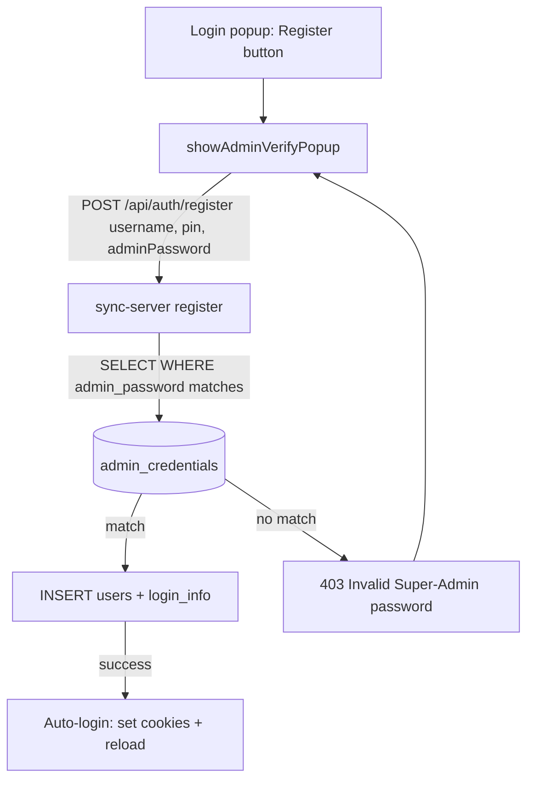

# Requirements

### Overview & Goals
The login popup currently lets a user only log in — a previous change deliberately removed registration from the UI. The user now wants a **Register** button back, but locked behind a **Super-Admin** gate so only someone who knows the Super-Admin password can create new accounts. When **Register** is clicked, the app must ask for the Super-Admin password in a website-themed popup; that password is checked against a new, manually-populated database table before the username/PIN typed into the login fields are saved as a new account.

Goals:
1. Add a **Register** button to the login popup that saves the username/PIN from the login fields as a new account.
2. Gate registration behind a Super-Admin password collected via a website-themed popup (never a browser `prompt`).
3. Verify that Super-Admin password server-side against a new two-column table (`admin_name`, `admin_password`) that the operator populates by hand.
4. On success, auto-log-in the newly created account.

### Scope
**In Scope**
- A **Register** button in `showLoginPopup()` (`app.js`) alongside Login / Set Server / Cancel.
- A new themed popup (`showAdminVerifyPopup()`) that asks only for the Super-Admin password.
- A gated `POST /api/auth/register` in `sync-server.js` that requires and verifies the Super-Admin password before creating the account.
- A new `admin_credentials` table (exactly two columns: `admin_name`, `admin_password`) created by `initDatabaseSchema()` and populated manually by the operator.
- Auto-login of the new account on successful registration.

**Out of Scope**
- Any UI to create/manage admin rows (the operator inserts the row directly in the DB).
- Changing the login flow, the Set-Server flow, or the Case #/sync-bucket logic.
- Hashing the Super-Admin password (it is stored and compared as plaintext, per request) or broader password hardening.
- Editing or deleting existing user accounts.

### User Stories
- As an operator, I want a Super-Admin password gate on registration so only I (or people I trust) can create new team accounts.
- As a user who knows the Super-Admin password, I want a **Register** button on the login popup that turns the username/PIN I typed into a new account.
- As a user, I want the Super-Admin prompt to be a website-themed popup consistent with the rest of the app, not a raw browser dialog.
- As a newly-registered user, I want to be logged in immediately after registering so I don't have to retype my credentials.

### Functional Requirements
1. `showLoginPopup()` shows a **Register** button in addition to Login, Set Server, and Cancel.
2. Clicking **Register** first validates that a username and PIN are typed in the login fields; if either is empty it alerts and does not open the admin popup.
3. Clicking **Register** (with fields filled) opens a themed `createPopup()`-based popup (e.g. titled "Super-Admin Verification") with a single password input and **Register** / **Cancel** buttons.
4. Submitting the admin popup sends `{ username, pin, adminPassword }` to `POST /api/auth/register` on the currently-configured sync server.
5. The server allows registration only if `adminPassword` matches the `admin_password` of ANY row in `admin_credentials`; otherwise it returns an error (HTTP 403) and creates no account.
6. If the admin password is valid but the username already exists, the server returns the existing "User already exists" error (HTTP 400) and creates nothing.
7. On success the client stores the credentials (username + PIN cookies), sets the current user, closes both popups, and reloads — logging the new account in automatically.
8. On any failure the popup shows a clear message from the server's JSON `error` field (e.g. "Invalid Super-Admin password.") and stays open so the user can retry.

### Non-Functional Requirements
- Reuse the existing themed popup + `pill-input` styling so the admin popup matches the site.
- The Super-Admin password is sent over the same channel as login (POST JSON) and is never logged by the client.
- Registration must remain impossible from the UI without a valid Super-Admin password — the gate lives server-side so it cannot be bypassed by editing the client.
- No regression to existing login, Set-Server, or authenticated data flows.

# Technical Design

### Current Implementation
- **Login popup (`app.js`, `showLoginPopup()` lines 622–719):** builds a `createPopup('Login', ...)` overlay with `usernameInput` + `pinInput` (`pill-input`), a **Login** button that POSTs to `/api/auth/login` and parses via `readJsonResponse()`, plus **Set Server** and **Cancel** buttons. A prior change removed the Register button (the comment at lines 697–700 states registration is intentionally absent here).
- **Themed popups:** `createPopup(title, originElement, onClose)` (lines 4938–4977) returns an overlay containing `.popup-content` and `.popup-buttons`; `closePopup(overlay)` (lines 4930–4936) fades it out. `showSetServerPopup()` (lines 725–797) is the existing example of a second popup opened from the login popup.
- **JSON parsing:** `readJsonResponse(resp)` (lines 604–620) returns parsed JSON for any JSON body regardless of status, and throws a descriptive error only for non-JSON/HTML responses — so a `403 { error }` body is returned and the caller checks `resp.ok && data.success`.
- **Credential storage:** on login success the client sets the `USER_NAME_STORAGE_KEY` and `USER_PASSWORD_STORAGE_KEY` cookies (the latter to the PIN), calls `setCurrentUser(data.user)`, then reloads (lines 681–686).
- **Server register (`sync-server.js`, `POST /api/auth/register` lines 523–544):** takes `{ username, pin }`, computes `sha256(pin)`, inserts into `users(username, password, pin)` and mirrors into `login_info`. It is currently **ungated** — anyone who can reach the endpoint can create an account.
- **Schema (`sync-server.js`, `initDatabaseSchema()` lines 305–381):** creates `store`, `users`, `user_buckets`, `user_settings`, `login_info`, and the structured tables via `CREATE TABLE IF NOT EXISTS`.
- **JSON fallbacks (`sync-server.js` lines 1266–1282):** a 404 handler and error middleware guarantee every API response — including register errors — is JSON, so the client's `readJsonResponse()` can surface them.

### Key Decisions
- **Gate registration server-side, inside `POST /api/auth/register` (chosen):** the endpoint requires `adminPassword` and verifies it against `admin_credentials` before inserting the user, in a single request. Rationale: the check cannot be bypassed by editing the client, and it keeps the flow to one round-trip.
- **Password-only match against any admin row (confirmed with user):** registration is allowed when the entered password equals the `admin_password` of any row; `admin_name` is informational bookkeeping only, so the popup asks for just the password.
- **Plaintext admin password, compared directly (confirmed with user):** the operator types their admin code into the `admin_password` column as-is and the server compares it directly (`SELECT ... WHERE admin_password = ?`). Rationale: matches the user's mental model of "manually enter my admin code."
- **Auto-login on success (confirmed with user):** reuse the exact login-success path (set cookies, `setCurrentUser`, reload) so the new account is signed in immediately.
- **New two-column table, populated manually:** `admin_credentials(admin_name, admin_password)` is created by `initDatabaseSchema()` (idempotent `CREATE TABLE IF NOT EXISTS`) but seeded by the operator directly in the DB — there is no UI to manage it.

### Proposed Changes
1. **`sync-server.js` — new table.** In `initDatabaseSchema()`, add:
   ```sql
   CREATE TABLE IF NOT EXISTS admin_credentials (
       admin_name VARCHAR(191) NOT NULL,
       admin_password VARCHAR(255),
       PRIMARY KEY (admin_name)
   ) ENGINE=InnoDB DEFAULT CHARSET=utf8mb4
   ```
2. **`sync-server.js` — gate `POST /api/auth/register`.** Read `{ username, pin, adminPassword }`. If `username`/`pin` is missing → 400 (unchanged). If `adminPassword` is missing → 403 "Super-Admin password is required." Then `db.get("SELECT admin_name FROM admin_credentials WHERE admin_password = ?", [adminPassword], ...)`; if no row matches → 403 "Invalid Super-Admin password." and create nothing; if a row matches → run the existing insert into `users` + `login_info` and return `{ success: true, user: { username, pin } }`.
3. **`app.js` — Register button.** In `showLoginPopup()`, add a `popup-btn` **Register** button (placed after Login). Its handler reads `usernameInput`/`pinInput`; if either is empty it alerts (e.g. "Enter a username and PIN to register."); otherwise it calls `showAdminVerifyPopup(username, pin, popup)`.
4. **`app.js` — new `showAdminVerifyPopup(username, pin, loginPopup)`.** Guard against double-open with a dedicated class; build with `createPopup('Super-Admin Verification', ...)`; add a short instruction label and a password `pill-input`; add a **Register** primary button and a **Cancel** button. The Register handler POSTs `{ username, pin, adminPassword }` to `${getSyncServerUrl()}/api/auth/register`, parses with `readJsonResponse()`, and on `resp.ok && data.success` performs the auto-login (set `USER_NAME_STORAGE_KEY`/`USER_PASSWORD_STORAGE_KEY` cookies, `setCurrentUser`, close the admin popup and the login popup, reload). On failure it `alert`s `data.error` and leaves the popup open. Cancel just closes the admin popup, returning to the login popup.

### Data Models / Contracts
- **New table** `admin_credentials(admin_name VARCHAR(191) PRIMARY KEY, admin_password VARCHAR(255))` — exactly two columns, seeded manually.
- **`POST /api/auth/register`** request body changes from `{ username, pin }` to `{ username, pin, adminPassword }`:
  - `403 { error: 'Super-Admin password is required.' }` when `adminPassword` is missing.
  - `403 { error: 'Invalid Super-Admin password.' }` when no `admin_credentials` row matches.
  - `400 { error: 'User already exists' }` unchanged.
  - `200 { success: true, user: { username, pin } }` on success.
- **New client function** `showAdminVerifyPopup(username, pin, loginPopup): void`.

### Components
- **`showLoginPopup()` (modified):** gains a **Register** button; the existing Login / Set Server / Cancel buttons are unchanged.
- **`showAdminVerifyPopup()` (new):** the themed Super-Admin password popup that performs the gated registration and auto-login.
- **`POST /api/auth/register` (modified):** now admin-gated.
- **`initDatabaseSchema()` (modified):** creates the `admin_credentials` table.

### File Structure
- `app.js` — **modified**: add the **Register** button in `showLoginPopup()`; add `showAdminVerifyPopup()`.
- `sync-server.js` — **modified**: add the `admin_credentials` table in `initDatabaseSchema()`; gate `POST /api/auth/register`.
- No HTML changes (the login popup is built entirely in `app.js`).

### Architecture Diagram


### Risks
- **Deployment:** the server-side gate and the new table only take effect if the current `sync-server.js` is deployed to Railway. On an outdated backend, `/api/auth/register` behaves differently (or the table is missing); the operator must redeploy and insert an `admin_credentials` row before registration works.
- **Empty admin table = no registration possible:** if no row exists, every attempt returns "Invalid Super-Admin password." This is by design; the operator must seed at least one row.
- **`readJsonResponse()` wording** references `/api/auth/login`; it is still accurate enough for register errors, though its guidance text mentions login specifically. Optional: generalize the wording (low priority, not required).
- **Plaintext storage** means anyone with DB read access can see the admin code; acceptable per the explicit request, but worth noting.

# Testing

### Validation Approach
- Run `node --check app.js` and `node --check sync-server.js` after edits (syntax).
- Run `node test_structured_tables.js` and `node test_sync_bucket_decoupling.js` to confirm no regressions in the server decompose logic and Case #/bucket coupling.
- Optionally start the server locally and exercise `POST /api/auth/register` with `curl` (valid / invalid / missing admin password) to confirm the JSON responses and status codes, since the admin gate is pure server logic.

### Key Scenarios
1. **Register button appears:** the login popup shows Login, Register, Set Server, and Cancel.
2. **Missing fields:** clicking Register with an empty username or PIN alerts and does not open the admin popup.
3. **Themed admin popup:** clicking Register (fields filled) opens the `createPopup`-based Super-Admin password popup (not a browser prompt).
4. **Valid admin password:** with a matching `admin_credentials` row, submitting creates the account and auto-logs-in (cookies set, page reloads).
5. **Invalid admin password:** a non-matching password returns 403 and the popup shows "Invalid Super-Admin password." with nothing created.
6. **Duplicate user:** a valid admin password with an existing username returns 400 "User already exists" and creates nothing.

### Edge Cases
- Missing `adminPassword` in the request → 403 "Super-Admin password is required."
- Empty `admin_credentials` table → every registration is rejected as an invalid admin password.
- Non-JSON / unreachable server → the client's `readJsonResponse()` surfaces a clear connection error and the popup stays open.

### Test Changes
- No UI test harness exists for these popups; add no new test files. Optionally add a small assertion that `sync-server.js` references `admin_credentials` in both the schema and the register handler; otherwise rely on `node --check` + the existing suites + manual/`curl` verification.

# Delivery Steps

### ✓ Step 1: Add the admin_credentials table and gate the register endpoint (sync-server.js)
Registration is allowed only when a Super-Admin password matching a manually-inserted row is supplied.

- In `initDatabaseSchema()` (lines 305–381), add `CREATE TABLE IF NOT EXISTS admin_credentials (admin_name VARCHAR(191) NOT NULL, admin_password VARCHAR(255), PRIMARY KEY (admin_name)) ENGINE=InnoDB DEFAULT CHARSET=utf8mb4` alongside the other tables.
- In `POST /api/auth/register` (lines 523–544), read `adminPassword` from the body and return 403 "Super-Admin password is required." when it is missing.
- Before inserting the user, run `SELECT admin_name FROM admin_credentials WHERE admin_password = ?`; if no row matches, return 403 "Invalid Super-Admin password." and create nothing.
- On a match, keep the existing insert into `users` + `login_info` and the `{ success: true, user: { username, pin } }` response; keep the "User already exists" (400) path intact.
- Verify with `node --check sync-server.js`, `node test_structured_tables.js`, and `node test_sync_bucket_decoupling.js`.

### ✓ Step 2: Add the Register button and themed Super-Admin popup with auto-login (app.js)
The login popup can register the typed credentials after a themed Super-Admin password check, then logs the new account in.

- In `showLoginPopup()` (lines 622–719), add a **Register** `popup-btn` (after the Login button) whose handler validates that username + PIN are filled (else alert) and calls `showAdminVerifyPopup(username, pin, popup)`.
- Add `showAdminVerifyPopup(username, pin, loginPopup)`: a `createPopup('Super-Admin Verification', ...)` popup (guarded against double-open) with an instruction label, a password `pill-input`, and **Register** / **Cancel** buttons.
- The Register handler POSTs `{ username, pin, adminPassword }` to `${getSyncServerUrl()}/api/auth/register`, parses via `readJsonResponse()`, and on `resp.ok && data.success` performs the login-success path (set `USER_NAME_STORAGE_KEY`/`USER_PASSWORD_STORAGE_KEY` cookies, `setCurrentUser(data.user)`, close both popups, `window.location.reload()`).
- On failure, `alert(data.error || 'Registration failed')` and keep the popup open; Cancel closes only the admin popup.
- Verify with `node --check app.js`.