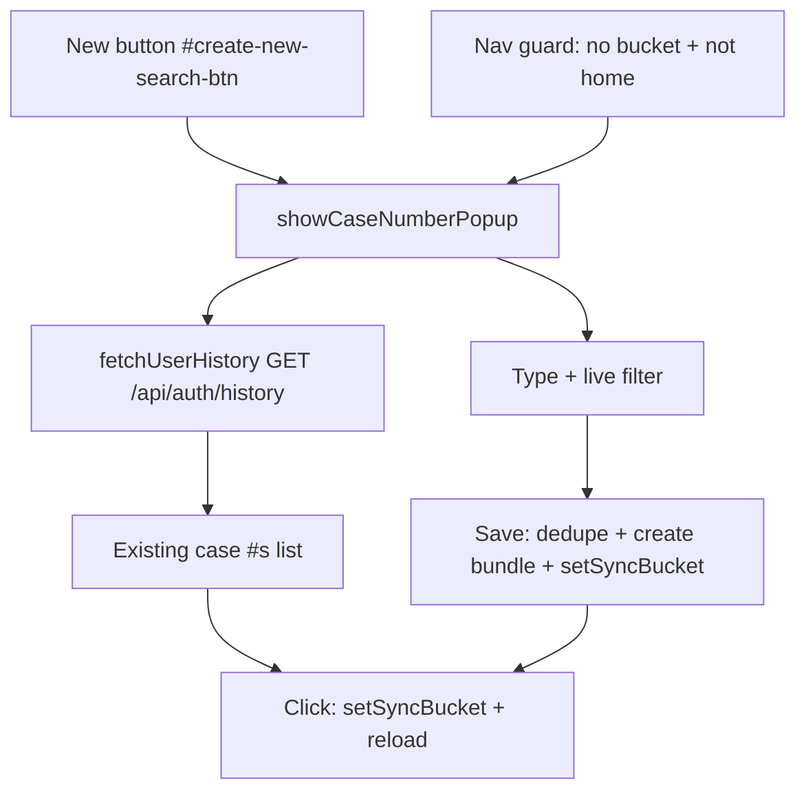

# Requirements

### Overview & Goals
After logging in, users are unable to navigate to any page other than the home page — they are instantly bounced back. This happens because the app requires a *case number* (internally a "sync bucket") to be set before any non-home page can be used, and there is currently no good way to create or pick one. The goals are:

1. Stop the silent redirect loop and instead guide the user to choose/create a case number.
2. Replace the crude browser `prompt()` used by the **New** button with a proper, website-themed popup for managing case numbers.

### Scope
**In Scope**
- A themed popup (opened by the **New** button next to the CASE # box) that lets the user:
  - Type a new case number.
  - See a live list of case numbers already associated with their account.
  - Filter that list in real time as they type.
  - Save a new case number, with exact-duplicate prevention.
  - Select an existing case number from the list to switch to it.
- Change the post-login navigation guard so that, when no case number is set, the app opens this popup instead of silently redirecting to home.

**Out of Scope**
- Any server-side (`sync-server.js`) changes — the existing `/api/auth/history` endpoint already returns per-account case numbers.
- Renaming or deleting existing case numbers.
- Registration or authentication changes.

### User Stories
- As a logged-in user, I want to click **New** by the CASE # box and get a website-themed popup (not a raw browser prompt) to type my case number.
- As a user, I want to see the case numbers already associated with my account so I can reuse one instead of retyping it.
- As a user, I want the list to filter down as I type so I can quickly find a matching case number.
- As a user, I want to be blocked from creating an exact duplicate of a case number that already exists when I hit **Save**.
- As a user, I want navigating between pages to work once I've chosen a case number, instead of being bounced back to home.

### Functional Requirements
1. Clicking **New** (`#create-new-search-btn`) opens a themed popup built with the existing `createPopup()` helper.
2. The popup contains a text input for the new case number and a scrollable, filterable list of existing case numbers fetched via `fetchUserHistory()`.
3. Typing in the input filters the existing-case-number list case-insensitively (substring match), matching the existing `updatePills()` pattern.
4. Clicking an existing case number in the list switches to it (`setSyncBucket(...)`) and reloads, preserving today's "switch search" behavior.
5. **Save** validates the typed name; if a case number with the same (normalized) name already exists, it is rejected with a clear message and nothing is created.
6. On a valid, non-duplicate name, **Save** creates the new search (preserving personnel/accounts, as the current New flow does), sets the sync bucket, and reloads.
7. When no case number is set after login, the navigation guard opens the case-number popup instead of redirecting to `home.html`.

### Non-Functional Requirements
- Reuse existing popup, input, and pill styling (`createPopup`, `pill-input`, `mini-pill`) so the popup matches the site theme.
- The history fetch must not block popup rendering; the list populates asynchronously and degrades gracefully if the server is unreachable (empty list).

# Technical Design

### Current Implementation
- **CASE # UI** lives in `home.html`: an input `#bundle-file-name`, a `#save-file-name` button, and a `#create-new-search-btn` (**New**) button.
- **New button handler** is wired in `buildHomePage()` in `app.js` (around lines 7189–7255). It opens a confirm popup, then calls the native `prompt('Enter a name for the new search:', ...)`, sanitizes the name, builds a new bundle via `defaultBundle()`, preserves personnel/accounts, calls `setSyncBucket(newBucket)` and `saveBundle(...)`, then reloads.
- **Case numbers = sync buckets.** `getSyncBucket()`/`setSyncBucket()` (lines 449–463) read/write `SYNC_BUCKET_STORAGE_KEY` in `_serverSettings`.
- **Existing case numbers per account** come from `fetchUserHistory()` (lines 560–579), which calls `GET /api/auth/history` and returns `[{ bucket, lastAccessed }]` from the server's `user_buckets` table (`sync-server.js` line 581). This is already used by `populateSearchHistory()` (line 7136) to render a switchable list on the home page.
- **Navigation guard** in the `DOMContentLoaded` handler (`app.js` line 10694): `if (!getSyncBucket() && !isHomePage()) { window.location.href = 'home.html'; return; }` — this is the source of the "bounced back to home" behavior.
- **Reusable filter pattern:** `showUserSelectionPopup()` (lines 5019–5094) demonstrates a search input (`pill-input`) driving an `updatePills()` function that re-renders `mini-pill` buttons filtered by a lowercased substring query.

### Key Decisions
- **Redirect behavior — Prompt to pick case # (confirmed with user):** keep the requirement that a case number be set before using non-home pages, but replace the silent `window.location.href = 'home.html'` bounce with opening the new case-number popup so the user can create/select one in place.
- **Reuse existing patterns:** build the popup with `createPopup()` and reuse the `pill-input` + `mini-pill` + live-filter approach from `showUserSelectionPopup()` for consistency and minimal new code.
- **Duplicate detection uses the same normalization as bucket creation:** compare the typed name after the same sanitization the New flow already applies (`replace('.json','').replace(/[^a-zA-Z0-9_-]/g, '_')`) against the buckets returned by `fetchUserHistory()`, case-insensitively, so "exact duplicate" is judged on the actual stored bucket id.
- **No server changes:** the `/api/auth/history` endpoint already provides everything needed.

### Proposed Changes
1. **New function `showCaseNumberPopup()` in `app.js`:**
   - Build via `createPopup('New Case Number', ...)`, add a class (e.g. `case-number-popup`) and guard against double-open.
   - Add a `pill-input` text field for the new case number and a scrollable list container for existing case numbers.
   - On open, call `fetchUserHistory()` and cache the results; render an `updateList()` function (mirroring `updatePills()`) that filters cached case numbers by the lowercased input value and renders each as a clickable `mini-pill`/row.
   - Clicking an existing entry: `setSyncBucket(entry.bucket)` then `window.location.reload()` (same as `populateSearchHistory()`).
   - **Save** button: trim input; reject empty; compute the normalized bucket id; if it matches any existing bucket (case-insensitive) show an alert and abort; otherwise run the existing New-search creation logic (preserve personnel/accounts, `defaultBundle()`, `logCreation`, `setSyncBucket`, `saveBundle`, reload).
   - A **Cancel** button that closes the popup.
2. **Rewire the New button** in `buildHomePage()` to call `showCaseNumberPopup()` instead of the current confirm+`prompt()` block, removing the native `prompt()` usage.
3. **Update the navigation guard** (line 10694): when `!getSyncBucket() && !isHomePage()`, redirect to `home.html` and then open `showCaseNumberPopup()` (or, if already home, just open the popup) so the user is prompted to pick a case number instead of being silently bounced.

### Data Models / Contracts
- `fetchUserHistory(): Promise<Array<{ bucket: string, lastAccessed: string }>>` — existing, unchanged.
- New: `showCaseNumberPopup(): void` — renders the themed popup; no return value.
- Bucket id normalization (existing, reused): `name.replace(/\.json$/i, '').replace(/[^a-zA-Z0-9_-]/g, '_')`.

### File Structure
- `app.js` — **modified**: add `showCaseNumberPopup()`, rewire `#create-new-search-btn` handler in `buildHomePage()`, adjust the navigation guard in the `DOMContentLoaded` handler.
- `home.html` — no change (existing `#create-new-search-btn` reused).
- `sync-server.js` — no change.

### Architecture Diagram

### Risks
- **Server unreachable:** `fetchUserHistory()` returns `[]` on error, so duplicate detection can only check what it can fetch; Save should still proceed for new names. Mitigation: treat an empty/failed fetch as "no known duplicates" and rely on the server's `user_buckets` PRIMARY KEY to avoid true collisions.
- **Guard + popup timing:** opening the popup right after a redirect must happen after `DOMContentLoaded`/credentials are available; ensure the popup is invoked in the same init flow where `getSyncBucket()` is checked.

# Testing

### Validation Approach
Because this is browser UI logic in `app.js`, validate with a static syntax check plus targeted manual/DOM reasoning against the acceptance criteria. Run `node --check app.js` to confirm no syntax errors after edits (the same check used previously in this project).

### Key Scenarios
1. **New button opens themed popup:** clicking **New** shows the `createPopup`-based popup (not a browser `prompt`).
2. **Existing list loads:** the popup lists case numbers returned by `fetchUserHistory()`.
3. **Live filtering:** typing filters the list case-insensitively to matching case numbers.
4. **Duplicate prevention:** typing a name whose normalized bucket matches an existing one and clicking **Save** shows a rejection message and creates nothing.
5. **Create new:** typing a unique name and clicking **Save** creates the search, sets the bucket, and reloads.
6. **Select existing:** clicking an existing entry switches to it and reloads.
7. **Navigation prompt:** logging in with no case number and attempting to leave home opens the case-number popup instead of a silent bounce.

### Edge Cases
- Empty input on **Save** is rejected.
- Names differing only by case or by non-alphanumeric characters that normalize to the same bucket id are treated as duplicates.
- `fetchUserHistory()` failing returns an empty list; the popup still renders and Save still works for new names.

### Test Changes
- No automated UI test framework exists for these popups; add no new test files. Rely on `node --check app.js` and manual verification of the scenarios above.

# Delivery Steps

### ✓ Step 1: Add themed case-number popup with live filtering and duplicate prevention
A new `showCaseNumberPopup()` in `app.js` renders a website-themed popup for creating and picking case numbers.

- Add `showCaseNumberPopup()` built with the existing `createPopup()` helper, guarding against double-open with a dedicated overlay class.
- Add a `pill-input` text field for the new case number and a scrollable list container for existing case numbers.
- Call `fetchUserHistory()` on open, cache the results, and render an `updateList()` function that filters cached case numbers case-insensitively as the user types (mirroring the `updatePills()` pattern in `showUserSelectionPopup()`).
- Render each existing case number as a clickable `mini-pill`/row that calls `setSyncBucket(entry.bucket)` and reloads.
- Implement the **Save** button: trim input, reject empty, compute the normalized bucket id, reject exact duplicates (case-insensitive match against fetched buckets) with a clear alert, and otherwise run the existing New-search creation logic (preserve personnel/accounts via `defaultBundle()`, `logCreation`, `setSyncBucket`, `saveBundle`, reload).
- Add a **Cancel** button that closes the popup.

### ✓ Step 2: Rewire the New button to use the new popup
The **New** button next to the CASE # box opens the themed popup instead of a native browser prompt.

- In `buildHomePage()` in `app.js`, replace the current `#create-new-search-btn` handler (the confirm popup + `prompt()` block, ~lines 7189–7255) with a call to `showCaseNumberPopup()`.
- Remove the now-unused native `prompt()`-based creation code.
- Verify with `node --check app.js`.

### ✓ Step 3: Fix the post-login navigation guard to prompt for a case number
Navigating away from home with no case number set opens the case-number popup instead of silently bouncing to home.

- Update the navigation guard in the `DOMContentLoaded` handler in `app.js` (line ~10694): when `!getSyncBucket() && !isHomePage()`, redirect to `home.html` and then open `showCaseNumberPopup()`; if already on home, just open the popup.
- Ensure the popup is invoked after credentials/settings are available in the init flow so `fetchUserHistory()` works.
- Verify with `node --check app.js`.