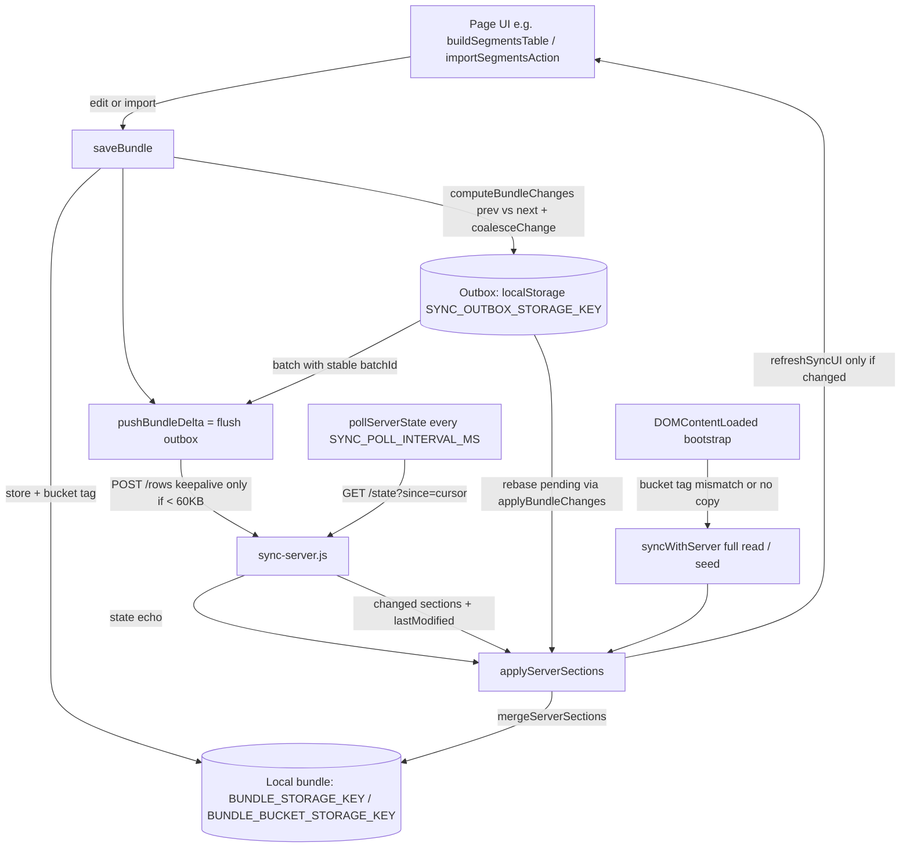

# Requirements

### Overview & Goals
Imported segments vanish from the Segments page (`page2.html`) a second after it renders. Investigation shows this is a **sync regression introduced by commit `e54302c`**: the client half of the row-level sync rewrite was never finished, so every save silently falls back to a whole-file upload that browsers reject once the case grows past 64 KiB (which happens as soon as CalTopo features are loaded — the very thing needed to import segments from CalTopo). The server therefore keeps a stale copy, and the page's blind "pull current page" step replaces the freshly imported rows with that stale copy.

Goal: finish the outbox-based sync the last commit started, so that
- rows a device changed are **never** discarded by a server read, and
- a change made on one page reliably reaches the server (and the other devices) regardless of bundle size, navigation timing, or a dropped connection.

### Scope
**In scope**
- Client sync layer in `app.js` (`saveBundle`, `pushBundleDelta`, `pushBundleToServer`, `syncWithServer`, `pullCurrentPageData`, the bootstrap in `DOMContentLoaded`, the click/focusout/visibility sync hooks).
- Persistent outbox under `SYNC_OUTBOX_STORAGE_KEY`, bucket tagging under `BUNDLE_BUCKET_STORAGE_KEY`, `/state` polling every `SYNC_POLL_INTERVAL_MS`, removal of the legacy snapshot (`LEGACY_SYNC_SNAPSHOT_STORAGE_KEY`).
- Rebase of undelivered local rows on top of server data (chosen strategy).
- `recalculateEverything()` saving only when values changed (chosen strategy); `importSegmentsAction()` no longer causing a burst of whole-file uploads.
- Test suite: fix the already-failing `test_row_level_sync.js`, add a regression test that reproduces the reported scenario.

**Out of scope**
- Server changes (`sync-server.js` already exposes `/rows` with `batchId`, `/state?since=`, `PUT /bundle?seed=1`).
- Per-section "skip heavy keys" optimisation of the poll (documented as a follow-up).
- Pre-existing oddities in Saved Cases "Load" (it saves a cached bundle without switching the bucket).
- README (UTF-16 encoded) is not touched.

### User Stories
- As an operator, I want segments I import (from JSON or CalTopo) to stay on the Segments page after I navigate there, so that I can start planning immediately.
- As an operator working with a large case (maps, uploads), I want my edits to reach the server even though the case file is several MB, so that other devices see them.
- As an operator with a flaky connection, I want edits made while offline to be delivered automatically when the connection returns, without duplicates.
- As a team, we want two devices editing different rows at the same time to both keep their entries (the promise of the row-level sync).
- As an operator switching cases, I want never to see (or upload) rows that belong to a different case.

### Functional Requirements
1. Every `saveBundle()` diffs the new bundle against the copy that was on the device just before it (`SARSyncDelta.computeBundleChanges`) and appends the resulting row changes to a persistent outbox (`localStorage[SYNC_OUTBOX_STORAGE_KEY]`), coalescing consecutive edits of the same row (`coalesceChange`).
2. The outbox is flushed to `POST /api/v1/<bucket>/rows` with a stable `batchId`; a batch stays queued until the server confirms it (`success` or `duplicate`). A reload or dropped connection never loses it.
3. `keepalive: true` is used only when the request body is under 60 KB; larger bodies are sent as normal requests. Whole-file uploads never use `keepalive`.
4. Server data (from `/state`, `/rows` responses, or the full `/bundle` read) is applied by overlaying the received sections (`mergeServerSections`) and then **re-applying the device's still-pending outbox changes on top** (`applyBundleChanges`), so undelivered rows are shown and later re-sent. Blind page replacement (`pullCurrentPageData`) is removed.
5. Every page polls `GET /state?since=<cursor>` every `SYNC_POLL_INTERVAL_MS` (4 s) while visible, immediately after a flush, when the tab becomes visible, and when the browser goes online. The cursor is advanced **only** from `/state` answers.
6. The local bundle is tagged with its sync bucket (`BUNDLE_BUCKET_STORAGE_KEY`). On load, a local copy whose tag differs from `getSyncBucket()` is discarded and the case is read from the server (one-time full read; `PUT /bundle?seed=1` if the server has nothing).
7. A device upgrading from the previous build (local copy present but untagged) queues its **additive** local differences (new rows / filled blank rows) to the outbox before adopting the server copy, so rows stranded by the regression are delivered rather than lost.
8. `recalculateEverything()` saves (and therefore pushes) only if the recalculated bundle differs from the loaded one; rendering a page is network-silent.
9. UI refresh after applying server data happens only when the local bundle actually changed and never while the user is editing or a button action is in progress (existing `isUserActionActive()` gate).

### Non-Functional Requirements
- No change to the server API; older self-hosted servers without `/rows`/`/state` still get the whole-file fallback (`400/404/405/501`).
- localStorage footprint shrinks (legacy full-bundle snapshot removed; outbox holds rows only).
- `npm test` passes; all existing wiring assertions in `test_row_level_sync.js` remain valid or are updated to the new function names.
- Works in Chrome, Edge, Safari, Firefox (no reliance on `keepalive` for large payloads).

# Technical Design

### Current Implementation (root-cause chain)
All references are to `app.js` (15 936 lines) unless stated.
1. **Undefined constant.** Commit `e54302c` renamed `SYNC_SNAPSHOT_STORAGE_KEY` → `LEGACY_SYNC_SNAPSHOT_STORAGE_KEY` (line 24) and added `SYNC_OUTBOX_STORAGE_KEY`, `BUNDLE_BUCKET_STORAGE_KEY`, `SYNC_POLL_INTERVAL_MS` (lines 19–27), but `readSyncSnapshot()`/`writeSyncSnapshot()` (15528–15547) still use the old name. The `ReferenceError` is swallowed by their `try/catch`, so the snapshot is **always `null`**. (A static scan confirms: used-but-undeclared = `SYNC_SNAPSHOT_STORAGE_KEY`; declared-but-unused = the four new constants.)
2. **Every save becomes a whole-file upload.** `pushBundleDelta()` (15556–15610) hits the `!snapshot` branch and calls `pushBundleToServer(bundle)`.
3. **Whole-file uploads fail silently for cases > 64 KiB.** `pushBundleToServer()` (15666–15707) PUTs the full bundle twice with `keepalive: true`; Chromium/WebKit reject keepalive bodies over 64 KiB with `TypeError: Failed to fetch`. Loading CalTopo features stores GeoJSON in `bundle.maps[0].features` (14107–14111), pushing the bundle over the limit. Only `console.error` records the failure.
4. **Blind overwrite.** `pullCurrentPageData()` (15634–15664) replaces `pages[key]` with the server's copy without any freshness check. It runs 1 s after load (15929), after every button click (15873–15892) and after every `focusout` (15845–15870). Stale server page → imported rows disappear → `refreshSyncUI()` → `buildSegmentsTable()`.
5. **Rendering writes.** `buildSegmentsTable()` (4029) → `recalculateEverything()` → `saveBundle()` (3627): a re-render pushes; after the stale pull it pushes the segment-less table back. `importSegmentsAction()` (13151–13221) saves three times in a burst (13209, 13210→3627, 13211→4029).
6. `test_row_level_sync.js:116` already fails against current `sync-delta.js` (expects a legacy `length` change; the diff now emits `append`).

Reported sequence: import on Maps page (features loaded → bundle > 64 KiB) → pushes fail → open `page2.html` → `syncWithServer()` sees local newer, keeps it → table shows segments → +1 s `pullCurrentPageData()` → stale server page2 → local overwritten → table rebuilt without segments.

Server side (`sync-server.js`) already provides everything the client needs: `POST /rows` (1036) with `batchId` dedupe (`wasBatchApplied`/`rememberBatch`) and a `state` echo; `GET /state?since=&skip=&pages=` (1115) built on `stampSections`/`sectionsChangedSince`; `PUT /bundle?seed=1` (1307) that refuses to replace an existing file (409 `alreadyExists`).

### Key Decisions
1. **Outbox instead of server-confirmed snapshot** (the intent of the new constants): diff against the previous local copy at save time; persist changes; retry with a stable `batchId` until confirmed. No second full copy of the bundle in storage.
2. **Rebase pending rows** (user choice): server sections are the base; pending outbox changes are re-applied locally with `applyBundleChanges`; `append`/`prepend` are made idempotent on the client (skip rows already present) so a lost response cannot show a duplicate.
3. **Single `/state` cursor, no section skipping**: poll all sections; a changed heavy section is downloaded once per device per change. Simpler and never misses a change. (Per-heavy-key cursors noted as follow-up.) The cursor advances only from `/state` answers, never from `/rows` echoes (those don't carry other devices' untouched-section changes).
4. **Whole-file upload only for**: seeding a case the server has never seen (`?seed=1`), a file switch (`fileName` differs from the previous local copy → legacy PUT, keeps current Load/Import semantics), and legacy fallbacks (`needsFullSync`, `400/404/405/413/501`). Never with `keepalive`.
5. **Bucket-tagged local copy**; mismatched copies are discarded, outbox records are keyed `"<bucket>::<fileName>"` so pending rows of another case are never flushed into the current one.
6. **Render is network-silent** (user choice): `recalculateEverything()` saves only on change.
7. **No server changes**; `mergeBundles`/`mergeSegmentsRows` etc. stay for the legacy 403 reconcile path only.

### Proposed Changes
**A. Storage & outbox helpers (new, near `saveBundle`)**
- `outboxKeyFor(bundle)` → `"${getSyncBucket()}::${fileName}"` (replaces `syncSnapshotKeyFor`).
- `readOutboxRecord(bundle)` / `writeOutboxRecord(bundle, record)` on `SYNC_OUTBOX_STORAGE_KEY` (map keyed by outbox key).
- `queueBundleChanges(previousBundle, nextBundle)` → `computeBundleChanges` + `coalesceChange` into `record.changes`.
- `rebasePendingChanges(bundle, changes)` → deep-clone, `applyBundleChanges`, with idempotent append/prepend.
- `tagLocalBundleBucket()` → `setStorageItem(BUNDLE_BUCKET_STORAGE_KEY, getSyncBucket())`.
- `fetchInitWithKeepalive(body, init)` → adds `keepalive: true` only when `body.length < 60_000`.
- Startup cleanup: `removeStorageItem(LEGACY_SYNC_SNAPSHOT_STORAGE_KEY)`; delete `readSyncSnapshot`/`writeSyncSnapshot`/`syncSnapshotKeyFor`.

**B. `saveBundle(bundle, deferFlush = false)`**
- `previous = loadBundle()` (or `null` if nothing stored); `sanitized = sanitizeBundle(bundle)`.
- If `previous` exists and `previous.fileName === sanitized.fileName`: `queueBundleChanges(previous, sanitized)`; else mark `record.needsFullUpload = true` (file switch / first copy).
- Store, `tagLocalBundleBucket()`, `saveFileToList`, `updateFileNameDisplay()`; unless `deferFlush`, `return pushBundleDelta(sanitized)` (kept name so `saveBundle`→`pushBundleDelta(sanitized)` wiring stays).

**C. `pushBundleDelta(bundle)` = the outbox flush** (single in-flight promise `_outboxFlushPromise`, replaces `_inFlightPushPromise` in `isUserActionActive()`)
- `needsFullUpload` → `pushBundleToServer(bundle)` → clear flag + queued changes, record cursor.
- Build batch: reuse `record.inFlight.batchId` if present, else new id; `count = changes.length`.
- `POST /rows` `{fileName, batchId, changes}` via `apiFetch` + `fetchInitWithKeepalive`.
- `ok`: drop first `count` changes, clear `inFlight`; if `state` present → `applyServerSections(state)` (no cursor advance); loop while more changes queued.
- `409 needsFullSync` → `pushBundleToServer(bundle, {seed: true})`; on `409 alreadyExists` → `syncWithServer()` (adopt + rebase).
- `400/404/405/413/501` → `pushBundleToServer(bundle)` (legacy whole file), then clear batch.
- Network error / 5xx → keep queued (retried by next flush/poll/`online`).

**D. `pushBundleToServer(bundle, {seed=false, isReconcileRetry=false})`**: drop `keepalive`, add `?seed=1`, keep file-key PUT and the 403 → `reconcileAndRepushBundle` path.

**E. `applyServerSections(sections, lastModified, {advanceCursor=false})`**
- `merged = mergeServerSections(loadBundle(), sections)` → `rebasePendingChanges(merged, record.changes)` → `sanitizeBundle` → compare with current via `deepEqual`; store + tag if changed; if `advanceCursor` set `record.cursor = lastModified`; `refreshSyncUI()` only if changed.

**F. `pollServerState()`** — `GET /state?since=<record.cursor>`; `modified:false` → no-op; `404 found:false` → `syncWithServer()` (seed); else `applyServerSections(body.bundle, body.lastModified, {advanceCursor: true})`. Guarded by `isSyncing`/flush-in-progress; `withTimeout` bounded.
- `startSyncPolling()`: `setInterval(SYNC_POLL_INTERVAL_MS)` skipping hidden tabs; `visibilitychange`→visible and `online` trigger `pushBundleDelta(loadBundle()).then(pollServerState)`.
- Replace `pullCurrentPageData()` calls in the click handler, `scheduleSyncOnLeave()`, and the bottom-of-file timer with flush-then-poll; delete `pullCurrentPageData`/`fetchServerPageData`.

**G. `syncWithServer()` (full read; new device / bucket switch / home page)**
- Keep file-list sync and the single `resp.status === 404` → `pushBundleToServer(localBundle, {seed:true})` seed branch (test invariant).
- Read `GET /bundle` only (drop `/latest`, which can return a `user-<pin>` record). On success: legacy migration when the local copy is untagged and has the same `fileName` (queue additive diffs only), then `applyServerSections(serverBundle, lastModified, {advanceCursor:true})`, then flush. Remove `mergeBundles`/`sMod > lMod`/snapshot logic from this function.

**H. Bootstrap (`DOMContentLoaded`, 12523–12675)**
- After `loadServerSettings()`: if a local bundle exists and `getStorageItem(BUNDLE_BUCKET_STORAGE_KEY) !== getSyncBucket()` → `removeStorageItem(BUNDLE_STORAGE_KEY)`.
- No local copy → `await withTimeout(syncWithServer(), 10000)`; else `await withTimeout(pushBundleDelta(loadBundle()).then(pollServerState), 10000)`.
- `startSyncPolling()` before the home/settings early returns. `deleteCaseEverywhere()` also drops the outbox record for that key.

**I. Write hygiene**
- `recalculateEverything()`: snapshot `JSON.stringify` of the loaded bundle (minus `lastModified`) before mutation; return early without `saveBundle` when unchanged; return the save promise otherwise.
- `importSegmentsAction()`: `saveBundle(b, true)` (queue, defer flush) → `recalculateEverything()` (queues PSR cells and flushes once) → `buildSegmentsTable()`; `endUserAction()` after the flush promise.

### Data Models / Contracts
```js
// localStorage[SYNC_OUTBOX_STORAGE_KEY]
{ "<bucket>::<fileName>": {
    cursor: "<server lastModified ISO or ''>",   // advanced only by /state answers
    changes: [ {path, value, previous} | {path, append} | {path, deleted, previous} ],
    inFlight: { batchId: "<uuid>", count: 3 } | null,
    needsFullUpload: false
} }
// localStorage[BUNDLE_BUCKET_STORAGE_KEY] = getSyncBucket()

// POST /api/v1/<bucket>/rows  {fileName, batchId, changes}
//   -> {success, applied, duplicate?, lastModified, state?}
// GET  /api/v1/<bucket>/state?since=<cursor>
//   -> {found, modified, lastModified, bundle?}  |  404 {found:false}
// PUT  /api/v1/<bucket>/bundle?seed=1  -> 200 | 409 {alreadyExists:true}
```
Signatures: `saveBundle(bundle, deferFlush=false): Promise`, `pushBundleDelta(bundle): Promise<boolean>`, `pushBundleToServer(bundle, {seed, isReconcileRetry}={})`, `applyServerSections(sections, lastModified, {advanceCursor}={}): boolean`, `pollServerState(): Promise<boolean>`, `rebasePendingChanges(bundle, changes): bundle`, `startSyncPolling()`.

### Components
- `app.js` sync layer (lines ~2954–2980, 14973–15936): rewritten as described; `mergeBundles` & row mergers retained for `reconcileAndRepushBundle`.
- `app.js` bootstrap (12523–12675) and bottom-of-file hooks (15862–15936).
- `app.js` `recalculateEverything` (3517–3633), `importSegmentsAction` (13151–13221), `deleteCaseEverywhere` (3026–3079).
- `sync-delta.js`: unchanged (already provides `computeBundleChanges`, `coalesceChange`, `applyBundleChanges`, `mergeServerSections`, `deepEqual`).
- `sync-server.js`: unchanged.

### File Structure
- Modified: `app.js`, `test_row_level_sync.js`, `package.json` (add new test to `npm test`).
- Added: `test_sync_outbox.js` (vm-sandbox test modelled on `test_personnel_role_toggles.js`, loading `sync-delta.js` + `app.js` with fake `localStorage`/`fetch`).

### Architecture Diagram


### Risks
- **Server `batchId` memory is per-process**: after a server restart a retried batch could be applied twice (only `append` rows would duplicate). Mitigated by the small retry window; client-side rebase dedupes the display.
- **Diff cost on large bundles**: `computeBundleChanges` deep-compares `maps`/`uploads` on every save; same cost the original snapshot design had. `saveFileToList` already stringifies the whole bundle per save.
- **Legacy migration** queues only additive diffs to avoid reverting other devices' newer edits; a stale local cell value is intentionally not re-sent.
- **Test regexes** in `test_row_level_sync.js` pin function names (`saveBundle`→`pushBundleDelta(sanitized)`, `syncWithServer` single `pushBundleToServer(` + `resp.status === 404`, `pushBundleDelta` containing `needsFullSync`, `404, 405`, `pushBundleToServer(bundle)`); the design keeps these, and updates only the `append` expectation and the `pullCurrentPageData` check.
- **Home/settings early returns** in `DOMContentLoaded` — polling must start before them.
- **UI churn**: server-driven re-render only when the bundle changed and never mid-edit (existing `isUserActionActive()` gate).

# Testing

### Validation Approach
- Run `npm test` (all existing suites + the new `test_sync_outbox.js`).
- Drive the real `app.js` in a Node `vm` sandbox (pattern from `test_personnel_role_toggles.js`): fake `localStorage`, `document.body.dataset.page = 'page2'`, `window.SARSyncDelta` loaded from `sync-delta.js`, and a scripted `fetch` that records every request (URL, method, `keepalive`, body size) and returns canned server answers.
- Static source assertions (pattern from `test_row_level_sync.js` wiring section) for invariants that are easiest to pin in code.

### Key Scenarios
1. **Reported bug, end to end**: seed a bundle whose `maps[0].features` makes it > 64 KiB; call `importSegmentsAction([...2 segments])`; assert the only network write is `POST …/rows` with row-level `changes` for `pages.page2` and **no** `keepalive` when the body ≥ 60 KB; then simulate a stale server (`GET /state` returning page2 without the rows) and assert `loadBundle().pages.page2` still contains both segments (rebase) and they remain queued in `SYNC_OUTBOX_STORAGE_KEY` until a `success` answer clears them.
2. **Outbox survives reload**: make `fetch` reject (offline), save an edit, create a fresh sandbox over the same storage, flush → the same `batchId` is re-sent; `duplicate:true` clears it.
3. **Cursor semantics**: `/rows` answer does not move `cursor`; `/state` answer does; `modified:false` is a no-op.
4. **Bucket tag**: local bundle tagged with bucket A + bootstrap with bucket B → local copy discarded and `GET /bundle` requested; same bucket → kept.
5. **Legacy migration**: untagged local copy with two extra segment rows vs server → exactly those additive rows are queued; a differing existing cell is not re-sent.
6. **Render is silent**: `buildSegmentsTable()`/`recalculateEverything()` on an already-consistent bundle performs no `fetch` and does not bump `lastModified`.
7. **Whole-file paths**: `/rows` → `409 needsFullSync` → `PUT /bundle?seed=1`; `405` → legacy `PUT /bundle` without `keepalive`; a `fileName` change → whole-file PUT (no diff).
8. **Server compatibility** (`test_row_sync_endpoint.js` already green): a batch with `batchId` applied once, duplicate reported.

### Edge Cases
- Two saves in quick succession (`importSegmentsAction` + `recalculateEverything`) → changes coalesced; flushes serialized; no overlapping batches.
- Pending `append` re-applied on rebase after the server already appended it → no duplicate row locally.
- Pending `deleted` whose `previous` no longer matches → not applied locally, refused by server, dropped on confirmation.
- `sync-delta.js` missing (`getSyncDeltaUtils()` null) → whole-file fallback without `keepalive`.
- `/state` `404 found:false` → seeding via `syncWithServer` (single `pushBundleToServer(` in that function).
- Tab hidden → no polling; visible again → immediate flush + poll.

### Test Changes
- `test_row_level_sync.js`: fix `adding a row…` to expect `{path:['pages','page2'], append:[row]}` (1 change); replace the `pullCurrentPageData` wiring check with `pollServerState` + `/state?since=`; add checks that `pushBundleToServer` no longer contains `keepalive: true` and that `saveBundle` references `SYNC_OUTBOX_STORAGE_KEY`/`BUNDLE_BUCKET_STORAGE_KEY`.
- New `test_sync_outbox.js`: scenarios 1–7 above plus a static guard that every `*_STORAGE_KEY` / `*_INTERVAL_MS` identifier referenced in `app.js` is declared (would have caught this regression).
- `package.json`: append `&& node test_sync_outbox.js` to the `test` script.

# Delivery Steps

### ✓ Step 1: Replace the broken snapshot with a persistent outbox and size-safe row pushes
Every save queues row-level changes in `localStorage[SYNC_OUTBOX_STORAGE_KEY]` and flushes them to `/rows` with a stable `batchId`; no whole-file upload is ever sent with `keepalive`.

- Add outbox helpers in `app.js` next to `saveBundle`: `outboxKeyFor`, `readOutboxRecord`/`writeOutboxRecord`, `queueBundleChanges` (uses `SARSyncDelta.computeBundleChanges` + `coalesceChange`), `tagLocalBundleBucket`, `fetchInitWithKeepalive` (keepalive only for bodies < 60 KB).
- Rewrite `saveBundle(bundle, deferFlush=false)`: read the previous local copy, queue the diff (or mark `needsFullUpload` when there is no previous copy or `fileName` changed), store, tag bucket, keep `saveFileToList`/`updateFileNameDisplay`, then `return pushBundleDelta(sanitized)`.
- Rewrite `pushBundleDelta(bundle)` as the serialized outbox flush (`_outboxFlushPromise` replaces `_inFlightPushPromise` in `isUserActionActive()`): batch with reused/new `batchId`, `POST /rows`, drop confirmed changes on `success`/`duplicate`, handle `409 needsFullSync` → seed, `400/404/405/413/501` → legacy `pushBundleToServer(bundle)`, network errors keep the batch queued.
- Update `pushBundleToServer(bundle, {seed, isReconcileRetry})`: remove `keepalive`, support `?seed=1`, keep the 403 → `reconcileAndRepushBundle` path.
- Delete `readSyncSnapshot`/`writeSyncSnapshot`/`syncSnapshotKeyFor`; remove `LEGACY_SYNC_SNAPSHOT_STORAGE_KEY` from storage at startup; `deleteCaseEverywhere` also drops the case's outbox record.
- Tests: create `test_sync_outbox.js` (vm sandbox loading `sync-delta.js` + `app.js`, recording fake `fetch`) covering: row-level `/rows` body for a > 64 KiB bundle without `keepalive`, outbox persistence across a simulated reload with the same `batchId`, `needsFullSync` → `?seed=1`, legacy status fallback; add the static guard that every `*_STORAGE_KEY`/`*_INTERVAL_MS` identifier used in `app.js` is declared. Fix the `append` expectation in `test_row_level_sync.js` and add the new test to `package.json`.

### ✓ Step 2: Apply server data by merge + rebase and poll /state instead of blind page pulls
Server data never discards undelivered local rows: sections are overlaid, pending outbox changes are re-applied on top, and every page polls `/state?since=` every `SYNC_POLL_INTERVAL_MS`.

- Add `rebasePendingChanges(bundle, changes)` (deep clone + `applyBundleChanges`, idempotent `append`/`prepend`) and `applyServerSections(sections, lastModified, {advanceCursor})` (`mergeServerSections` → rebase → `sanitizeBundle` → store+tag only if `deepEqual` says it changed → `refreshSyncUI()` only then; cursor advanced only when `advanceCursor`).
- Add `pollServerState()` (`GET /state?since=<cursor>`; `modified:false` no-op; `404 found:false` → `syncWithServer()`; else apply with `advanceCursor:true`), guarded against overlapping with a flush or `isSyncing`, bounded by `withTimeout`.
- Add `startSyncPolling()` (`setInterval(SYNC_POLL_INTERVAL_MS)`, skip when `document.hidden`); trigger flush-then-poll on `visibilitychange`→visible and `online`.
- Replace `pullCurrentPageData()` in the capture-phase click handler, `scheduleSyncOnLeave()`, and the bottom-of-file 1 s timer with `pushBundleDelta(loadBundle()).then(pollServerState)`; delete `pullCurrentPageData`/`fetchServerPageData`. Apply the `state` echo of `/rows` answers through `applyServerSections` without advancing the cursor.
- Tests (`test_sync_outbox.js`): the reported scenario — import two segments on a > 64 KiB bundle, then a stale `/state` answer lacking them → `loadBundle().pages.page2` still holds both and they stay queued; `/rows` answer leaves `cursor` unchanged while `/state` advances it; rebase does not duplicate an `append` the server already applied. Update the `pullCurrentPageData` wiring check in `test_row_level_sync.js` to `pollServerState` + `/state?since=`.

### ✓ Step 3: Bootstrap with a bucket-tagged local copy, single full-read/seed path, and legacy migration
A page load never shows or uploads another case's rows, a new device gets one full read, an upgraded device delivers rows stranded by the regression.

- In `DOMContentLoaded` after `loadServerSettings()`: discard the local bundle when `getStorageItem(BUNDLE_BUCKET_STORAGE_KEY) !== getSyncBucket()`; then either `await withTimeout(syncWithServer(), 10000)` (no local copy) or `await withTimeout(pushBundleDelta(loadBundle()).then(pollServerState), 10000)`; call `startSyncPolling()` before the home/settings early returns.
- Rewrite `syncWithServer()`: keep the `all-files` list sync and the single `resp.status === 404` → `pushBundleToServer(localBundle, {seed:true})` branch; read `GET /bundle` only (drop `/latest`); on success run the legacy migration (untagged local copy with the same `fileName` → queue only additive diffs: `append`/`prepend` and writes into blank rows) then `applyServerSections(serverBundle, lastModified, {advanceCursor:true})` and flush; remove `mergeBundles`/`sMod > lMod`/snapshot logic from this function (row mergers stay for `reconcileAndRepushBundle`).
- Handle `PUT /bundle?seed=1` → `409 alreadyExists` by adopting the server copy via `syncWithServer()`.
- Tests (`test_sync_outbox.js`): bucket-tag mismatch discards the local copy and issues `GET /bundle`; same bucket keeps it; untagged legacy copy with two extra segment rows queues exactly those rows and not a differing existing cell; `syncWithServer` static invariants from `test_row_level_sync.js` still pass.

### ✓ Step 4: Make rendering and segment import network-quiet
Rendering the Segments page issues no writes, and an import produces a single coalesced row batch instead of three whole-file uploads.

- `recalculateEverything()` (app.js ~3517): capture the loaded bundle (minus `lastModified`) before recomputing; return early with no `saveBundle` when `deepEqual` shows nothing changed; otherwise save and return the flush promise.
- `importSegmentsAction()` (app.js ~13151): `saveBundle(b, true)` (queue, defer flush) → `recalculateEverything()` (queues PSR/time cells and flushes once) → `buildSegmentsTable()`; `endUserAction()` after the flush promise; the 7 s highlight-clear rebuild stays render-only.
- Verify other render paths that call `recalculateEverything()` (`buildRegionsTable`, `saveRegionsAndRefresh`) still persist when values change.
- Tests (`test_sync_outbox.js`): `recalculateEverything()` on a consistent bundle makes no `fetch` and leaves `lastModified` untouched; `importSegmentsAction()` results in exactly one `/rows` batch whose changes cover the imported rows (including recalculated cells) and no `PUT /bundle`; run `npm test` end to end.