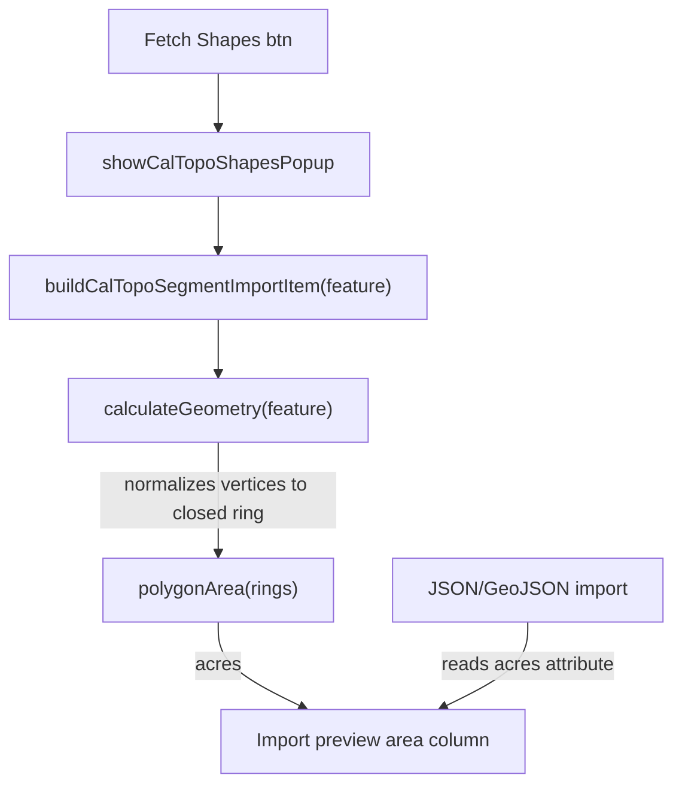

# Requirements

### Overview & Goals
The **Fetch Shapes** import from CalTopo occasionally reports a wildly wrong area — e.g. a real **1.7‑acre** shape is shown as **615.25 acres**. Other import paths (JSON/GeoJSON file import) read the area correctly. The goal is to make the geometry-based area computation used by Fetch Shapes correct and consistent with the other imports.

### Scope
**In Scope**
- Fix the polygon area calculation so it produces correct acreage for CalTopo shapes, regardless of whether the incoming ring is "closed" (first vertex repeated at the end) or "open".
- Ensure the fix applies to every shape in the Fetch Shapes preview (not just the first row).
- Add a regression test that reproduces the 1.7 vs 615 acre case.

**Out of Scope**
- Changing the JSON/GeoJSON file import path (it already works — it reads the area from attributes).
- UI/redesign of the import preview popups.
- Any change to CalTopo sync/write payloads.

### User Stories
- As a SAR planner, when I click **Fetch Shapes** and import CalTopo assignments, I want the **Area (acres)** column to match the real acreage so my segment sizing/PSR calculations are trustworthy.

### Functional Requirements
- A CalTopo assignment/shape whose true area is ~1.7 acres must import as ~1.7 acres (within normal rounding), not hundreds of acres.
- The area shown in the Fetch Shapes preview (`showCalTopoShapesPopup`) and the downstream import preview (`showSegmentsImportPreviewPopup`) must be identical and correct.
- The fix must be geometry-shape agnostic: polygons, multipolygons, buffered points, and closed/open rings must all compute correctly.

### Non-Functional Requirements
- No regressions to already-correct imports (GeoJSON polygons that repeat the first vertex).
- Keep the calculation self-contained in the existing frontend module; no new dependencies.

# Technical Design

### Current Implementation
All relevant code lives in `app.js`.

- Fetch Shapes builds each preview row via `buildCalTopoSegmentImportItem(feature)` (~line 12080), which calls `calculateGeometry(feature)` (~line 12002) for `area`, `length`, `width`, `height`.
- `calculateGeometry` normalizes CalTopo native shapes into GeoJSON-like geometry (~lines 12006–12020):
```js
geom = {
  type: isClosed ? 'Polygon' : 'LineString',
  coordinates: isClosed ? [vertices] : vertices   // <-- ring is NOT closed
};
```
- Polygon area is computed by `polygonArea(rings)` (~line 11961) using the planar shoelace formula:
```js
for (let i = 0; i < ring.length - 1; i++) {
  const p1 = ring[i]; const p2 = ring[i+1];
  ... area += (x1*y2 - x2*y1);
}
```

### Root Cause
`polygonArea` assumes each ring is **closed** — i.e. the last vertex equals the first (as in GeoJSON, e.g. `[[0,0],[0,1],[1,1],[0,0]]`). The shoelace loop stops at `ring.length - 1`, so the final "wrap" edge from the last vertex back to the first is only accounted for when that closing vertex is present.

CalTopo native assignments/shapes are normalized to `coordinates: [vertices]` **without** repeating the first vertex, producing an **open** ring. For an open ring the loop **skips the closing edge**. Because CalTopo coordinates are large-magnitude lon/lat values (e.g. `-122.x`, `47.x`) scaled by `69.172`, the individual shoelace terms are large (tens of millions) and normally cancel out to a tiny area; dropping the closing term leaves a large **uncancelled residual**, which inflates a ~1.7‑acre shape to ~615 acres.

This is exactly the user's "skipping a step" intuition — the missing step is closing the polygon ring. It appears to affect only "the first" segment because CalTopo returns a mix of representations: shapes already arriving as closed GeoJSON polygons compute correctly, while native/open-ring shapes (such as the top assignment) do not.

### Key Decisions
- **Fix location: `polygonArea`.** Make the shoelace routine robust to both closed and open rings by treating vertices cyclically (wrap the last→first edge) or by appending the first vertex when the ring is not already closed. This fixes every affected shape at once, independent of how `calculateGeometry` normalizes coordinates. Rationale: it is the true root cause and the single choke point all polygon area paths (`Polygon`, `MultiPolygon`) flow through.
- **Defensive normalization in `calculateGeometry`.** Also close the ring when synthesizing `coordinates: [vertices]` for native CalTopo shapes, so the geometry object itself is a valid closed GeoJSON polygon. This keeps downstream consumers (bounding box, any future callers) correct too.
- **Numerical robustness (optional but recommended).** Reduce catastrophic cancellation by translating coordinates relative to the ring's first vertex before the shoelace multiply (subtract a reference lon/lat). This keeps magnitudes small and makes the result stable.

### Proposed Changes
1. `polygonArea(rings)` (~line 11961):
   - Detect whether each ring is closed (`first === last`); if not, iterate cyclically so the closing edge `(last → first)` is always included.
   - Subtract the ring's first vertex as an origin reference before scaling to miles, to avoid large-number cancellation.
2. `calculateGeometry(item)` (~line 12011):
   - When building `coordinates: [vertices]` for a closed CalTopo shape, append a copy of the first vertex if it is not already equal to the last, producing a proper closed ring.
3. Extract the pure area math (or a thin wrapper) so it is unit-testable from Node — see Testing tab (mirror the helper into `map-segment-utils.js`, the existing UMD module used by all `test_*.js`).

### Data Models / Contracts
`calculateGeometry` return shape is unchanged: `{ area, length, width, height }` (area in acres, lengths in miles). Only the numeric correctness of `area` changes.

### File Structure
- Modified: `app.js` — `polygonArea`, `calculateGeometry`.
- Modified (optional, for testability): `map-segment-utils.js` — export a `polygonAreaAcres`/`ringArea` helper mirroring the fixed math.
- Added: `test_caltopo_area_calculation.js` — Node regression test in the existing `test_*.js` style.

### Architecture Diagram


### Risks
- **Double counting if a ring is already closed** — mitigated by explicitly checking `first === last` before appending/wrapping.
- **Sign/winding differences** — already handled by `Math.abs(area)`.
- **Buffered points path** (`Point` + `buffer`, ~line 12022) is unrelated and must remain untouched.

# Testing

### Validation Approach
Add a Node-based regression test following the existing convention (all `test_*.js` files `require('./map-segment-utils.js')` and run under `node`). To make the geometry math testable outside the browser, mirror the corrected area helper into `map-segment-utils.js` and have `app.js` use it (or keep app.js's copy in sync and test the helper).

### Key Scenarios
- **Open ring (the bug):** a small ~1.7‑acre polygon expressed as an open ring (first vertex NOT repeated) with realistic lon/lat coordinates → asserts computed area ≈ 1.7 acres (not ~615).
- **Closed ring (regression guard):** the same polygon with the first vertex repeated at the end → asserts the same ≈ 1.7 acres, confirming already-correct GeoJSON polygons are unaffected.
- **Consistency:** open and closed representations of the same shape return equal area.

### Edge Cases
- Degenerate ring (< 3 points) → area 0, no throw.
- MultiPolygon summing multiple rings.
- Very small polygon at high-magnitude coordinates (numerical stability after origin translation).

### Test Changes
- Add `test_caltopo_area_calculation.js` with the scenarios above.
- Confirm existing tests still pass (`test_caltopo_*.js`, `test_structured_tables.js`, etc.).

# Delivery Steps

### ✓ Step 1: Fix ring-closing in polygon area math
`polygonArea` returns correct acreage for both closed and open polygon rings, fixing the ~615-acre inflation of ~1.7-acre CalTopo shapes.

- In `app.js` `polygonArea` (~line 11961), detect whether each ring is closed by comparing the first and last vertex.
- Iterate the shoelace sum cyclically so the closing edge (last vertex → first vertex) is always included even when the ring is open.
- Translate each vertex relative to the ring's first vertex before scaling to miles, to avoid large-number floating-point cancellation.
- Keep `Math.abs(area)/2` and the `* 640` sq-mi→acres conversion; do not touch the buffered-point area branch.

### ✓ Step 2: Normalize CalTopo geometry to a closed ring
`calculateGeometry` produces a valid closed GeoJSON polygon for native CalTopo assignments/shapes so all downstream consumers get correct geometry.

- In `app.js` `calculateGeometry` (~line 12011), when synthesizing `coordinates: [vertices]` for a closed shape, append a copy of the first vertex if it is not already equal to the last.
- Ensure this applies to Assignment/Shape/Area/Sector/Buffer/Graphic normalization only, leaving LineString and Point paths unchanged.
- Verify `buildCalTopoSegmentImportItem` and `showCalTopoShapesPopup` now show identical, correct area values for every row, not just the first.

### ✓ Step 3: Add regression test for CalTopo area calculation
A Node test reproduces the 1.7-vs-615 acre bug and guards against regressions, runnable like the other `test_*.js` files.

- Mirror the corrected area helper into `map-segment-utils.js` (the existing UMD module) and export it, so it can be required from Node; have `app.js` reuse/stay consistent with it.
- Add `test_caltopo_area_calculation.js` asserting a ~1.7-acre open-ring polygon computes ≈1.7 acres (not ~615).
- Add assertions that the closed-ring representation of the same polygon yields the same area, plus a degenerate (<3 point) ring returning 0.
- Run the new test and the existing `test_caltopo_*` suite to confirm no regressions.