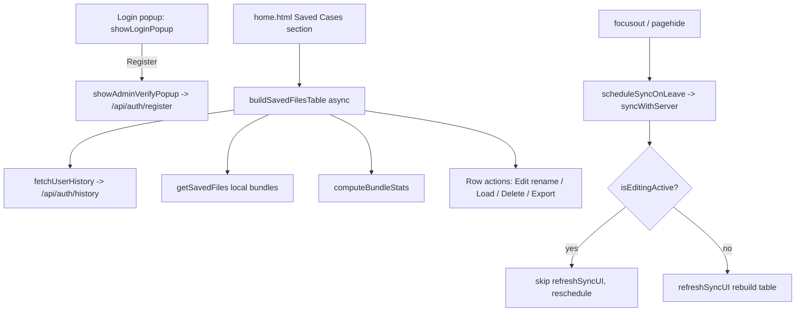

# Requirements

### Overview & Goals
Improve the Home page and login experience of the SAR Theory web app:

- Make the **Register** button reliably visible on the login popup (keeping the existing Super-Admin gate).
- Consolidate the Home page's **File Actions & Stats** controls (Case # field, Save / New / Import) into the **Saved Cases** section.
- Populate the Saved Cases section with the **case numbers listed under the current username** (the user's server-side case history), which today only appear in a separate "Case # History" panel.
- Redesign the Saved Cases table columns to show per-case metrics and richer row actions.
- Stop the app from pulling/re-rendering database data **while the user is typing in a cell or field**; pulls should happen after the user leaves the field, or without disturbing the active cursor.

### Scope
**In Scope**
- `home.html` layout changes (merge File Actions & Stats into Saved Cases).
- `app.js` login popup (`showLoginPopup`), Saved Cases rendering (`buildSavedFilesTable`), home stats/history wiring (`buildHomePage`, `populateSearchHistory`), and sync timing (`syncWithServer` / `scheduleSyncOnLeave` / `refreshSyncUI`).
- Minor `styles.css` tweaks if needed for the login popup / new table.

**Out of Scope**
- Changing the Super-Admin registration gate on the server (`sync-server.js` `/api/auth/register` stays as-is).
- Backend schema changes.
- Operational Charts, Recent Activity, and other Home panels not mentioned.

### User Stories
- As a new team member, I want a visible **Register** button on the login popup so I can request an account (still gated by the Super-Admin password).
- As a user, I want Save / New / Import and the Case # field to live in the Saved Cases section so all case management is in one place.
- As a user, I want the Saved Cases section to list the case numbers under my username, with each case showing its number, region count, segment count, personnel count, tasks logged, and actions (Edit / Load / Delete / Export).
- As a user, I want the app to stop yanking my cursor out of a cell to refresh data; it should refresh only after I leave the cell (or without moving my cursor).

### Functional Requirements
1. **Login popup** shows Login, **Register**, Set Server, and Cancel buttons. Register opens the Super-Admin verification popup (unchanged gate).
2. **File Actions & Stats panel is removed** as a standalone panel; its Case # input and Save / New / Import buttons move into the Saved Cases section header/toolbar.
3. **Saved Cases table** rows are sourced from the user's case history (`/api/auth/history` via `fetchUserHistory`) merged with any locally-cached cases, keyed by case number.
4. Saved Cases table columns (left to right): **Case #**, **Regions**, **Segments**, **Personnel**, **Tasks Logged**, **Actions**.
   - Regions/Segments/Personnel/Tasks are computed from each case's bundle **only when the bundle is available locally**; otherwise the cell shows a dash (`—`) placeholder until the case is opened.
   - Actions column buttons: **Edit** (rename the case number), **Load** (open the case), **Delete** (existing permission rules), **Export** (download the case JSON).
5. **Sync timing:** the app must not re-render tables (pull DB data) while an editable field is focused. Pulls occur after the user leaves the field/page, or are applied without removing the cursor from the active cell.

### Non-Functional Requirements
- No extra per-case network requests on Home load (sums computed only from already-cached bundles, per the chosen approach).
- Preserve existing sync correctness (edits still persist on blur / page switch).

# Technical Design

### Current Implementation
- **Login popup** — `showLoginPopup()` in `app.js` (~L622–731) builds `Login`, `Register`, `Set Server`, `Cancel` buttons. The Register button (`~L700–709`) calls `showAdminVerifyPopup()`; the gate is enforced server-side in `sync-server.js` `/api/auth/register` (~L534). `.popup-content` / `.popup-buttons` (`styles.css` ~L1310–L1332) have no max-height/overflow, so nothing clips the button.
- **Home layout** — `home.html`: the **File Actions & Stats** panel (L103–121) holds `#bundle-file-name`, `#save-file-name`, `#create-new-search-btn`, `#import-search-btn`, `#home-status`, `#import-search-input`, and `#dashboard-stats` (`#stat-regions/-segments/-personnel/-tasks`). The **Saved Cases** panel (L165–185) holds `#backup-all-zip-btn` and the table with `tbody#saved-files-body` (columns File Name / Last Modified / File Size / Actions). A separate **Case # History** panel (`#search-history-panel`, L62–67) is filled by `populateSearchHistory()`.
- **Saved Cases rendering** — `buildSavedFilesTable()` (`app.js` ~L7153–7257) reads local `getSavedFiles()` and renders Name / Date / Size / (Download, Delete).
- **Per-user case list** — `fetchUserHistory()` (~L578) → `GET /api/auth/history` returns `[{bucket, lastAccessed}]`; `bucketToCaseNumber()` (~L473) converts the internal suffixed bucket id to the clean CASE #. `populateSearchHistory()` (~L7259) currently renders these into `#search-history-panel`, not the Saved Cases table.
- **Stats logic** — `buildHomePage()` (~L7531–7552) computes current-case Regions/Segments/Personnel/Tasks from `bundle.pages.index.rows`, `page2`, `page3`, `page4`.
- **Sync timing** — already on-demand: `focusout` → `scheduleSyncOnLeave()` (200ms debounce) → `syncWithServer()` (~L13411) which pulls and calls `refreshSyncUI()` (~L13647). `refreshSyncUI()` fully rebuilds the current page's table, so when the user tabs from cell A to cell B, the debounced pull rebuilds the table and yanks the cursor out of cell B — this is the reported "pulling while I type" behavior. `pagehide` / `visibilitychange` also trigger `syncWithServer()`.

### Key Decisions
1. **Keep the Super-Admin register gate; only guarantee the button's presence/visibility** (per user). No change to `/api/auth/register`.
2. **Saved Cases sourced from case history merged with local files, keyed by case number.** History provides the full list of the user's cases; local `getSavedFiles()` provides bundles for sum computation.
3. **Compute sums for locally-cached cases only** (per user): rows without a cached bundle show `—` for the four metric columns until opened. No extra network fetch per case on load.
4. **Edit = rename case number** (per user), reusing the existing case-number / bucket concepts (`bucketToCaseNumber` / `setSyncBucket`).
5. **Fix sync-while-typing by guarding UI refresh during active editing.** Introduce an `isEditingActive()` helper (checks `document.activeElement` for input/textarea/select/contenteditable). `syncWithServer()` skips `refreshSyncUI()` (and reschedules) while editing is active, so the pull never rebuilds the focused table and never removes the cursor.

### Proposed Changes
**A. Login popup (`app.js` `showLoginPopup`)**
- Ensure the Register button is always appended and clearly labeled; keep `showAdminVerifyPopup()` gate. Add a defensive check so the button is not conditionally skipped.

**B. Home layout (`home.html`)**
- Remove the standalone **File Actions & Stats** panel (L103–121).
- Add a toolbar to the **Saved Cases** panel header containing `#bundle-file-name` (CASE # input), `#save-file-name`, `#create-new-search-btn`, `#import-search-btn`, plus the existing `#backup-all-zip-btn`; keep `#home-status` and hidden `#import-search-input` in this section.
- Replace the table header row with: `Case #`, `Regions`, `Segments`, `Personnel`, `Tasks Logged`, `Actions` (colspan of the empty-state cell updated to 6).
- Keep `#dashboard-stats` element IDs removed or repurposed (current-case stats now represented per-row).

**C. Saved Cases rendering (`app.js`)**
- Rework `buildSavedFilesTable()` into an async build that:
  1. Calls `fetchUserHistory()` and maps each entry through `bucketToCaseNumber()` to get the case-number list (dedup, preserve `lastAccessed` order).
  2. Reads `getSavedFiles()` for locally-cached bundles keyed by case number.
  3. For each case number, renders a row: number cell; four metric cells computed from the cached bundle (reuse the counting logic from `buildHomePage`) or `—` when no cached bundle; Actions cell.
  4. Actions: **Edit** (rename — prompt/popup that updates the case number/bucket), **Load** (`saveBundle(bundle)` + reload, or `setSyncBucket(caseNumber)` + reload for non-cached), **Delete** (reuse existing admin/file-manager permission logic + `deleteFileFromList`), **Export** (`downloadTextFile`).
- Factor the four count computations into a small helper `computeBundleStats(bundle)` used by both the row renderer and `buildHomePage`.
- Update `buildHomePage()`: remove the now-missing `#stat-*` wiring, keep `buildSavedFilesTable()` (now async) and existing Save/New/Import button wiring targeting the relocated controls. Optionally hide/retire `#search-history-panel` since its content now lives in Saved Cases.

**D. Sync timing (`app.js`)**
- Add `isEditingActive()` helper.
- In `syncWithServer()`, when a pull would change local data, skip calling `refreshSyncUI()` if `isEditingActive()` is true and instead re-run the sync shortly after (or on the next `focusout`), so the currently edited cell keeps its cursor.
- Keep `scheduleSyncOnLeave()`/`focusout`/`pagehide` triggers; ensure the debounced pull does not rebuild a table while a field remains focused (e.g., re-check `isEditingActive()` inside the timer callback).

### Data Models / Contracts
```js
// history entry from GET /api/auth/history
{ bucket: string, lastAccessed: string }
// local saved file entry from getSavedFiles()
{ [caseNumber]: { bundle: Bundle, lastModified: string } }
// derived per-row model for Saved Cases
{ caseNumber: string, stats: { regions:number, segments:number, personnel:number, tasks:number } | null, hasLocalBundle: boolean }

function computeBundleStats(bundle) {
  return {
    regions:   (bundle.pages.index.rows||[]).filter(r=>r[0]&&r[0].trim()).length,
    segments:  (bundle.pages.page2||[]).filter(r=>r[1]&&r[1].trim()).length,
    personnel: (bundle.pages.page3||[]).filter(r=>r[0]&&r[0].trim()).length,
    tasks:     (bundle.pages.page4||[]).filter(r=>r[0]&&r[0].trim()).length,
  };
}

function isEditingActive() {
  const el = document.activeElement; if (!el) return false;
  const tag = (el.tagName||'').toLowerCase();
  return tag==='input'||tag==='textarea'||tag==='select'||el.isContentEditable===true;
}
```

### Components / File Structure
- `home.html` — remove File Actions & Stats panel; extend Saved Cases panel with toolbar + new table header.
- `app.js` — `showLoginPopup`, `buildSavedFilesTable` (async, new columns/actions + rename), `buildHomePage` (stats wiring removed, helper extracted), new `computeBundleStats`/`isEditingActive`, `syncWithServer`/`scheduleSyncOnLeave` guards.
- `styles.css` — optional tweaks for the Saved Cases toolbar and table.

### Architecture Diagram


### Risks
- **Case-number vs fileName mismatch:** history keys are buckets (→ `bucketToCaseNumber`), local files are keyed by `bundle.fileName`. Merge must normalize both to the clean case number to avoid duplicate rows.
- **Async table build:** `buildSavedFilesTable` becomes async; callers (`buildHomePage`, `refreshSyncUI`, delete refresh) must not assume synchronous completion.
- **Rename semantics:** renaming a case number touches the bucket id/history; ensure Load still resolves the renamed case and that permission rules for delete/rename are respected.
- **Sync guard regressions:** skipping refresh during editing must still eventually apply server changes (reschedule on blur) so data isn't left stale.

# Testing

### Validation Approach
Manual/browser validation against the running frontend, exercising each functional requirement. Since logic lives in `app.js` DOM builders, verification is primarily UI-driven with console checks.

### Key Scenarios
1. **Login popup:** open the login popup → confirm Login, **Register**, Set Server, Cancel are all visible. Click Register with a username+PIN → Super-Admin verification popup appears (gate intact).
2. **Relocated controls:** on Home, the Case # input and Save / New / Import buttons appear inside the Saved Cases section and still work (save current case, create new case, import a `.json`).
3. **Case list population:** with a logged-in user that has case history, the Saved Cases table lists those case numbers (matching what the old Case # History panel showed).
4. **Metric columns:** for a case whose bundle is cached locally, Regions/Segments/Personnel/Tasks show counts equal to the current-case stats logic; for a case not cached locally, those cells show `—`.
5. **Row actions:** Edit renames the case number (list reflects new name); Load opens the case; Export downloads the case JSON; Delete respects admin/file-manager permissions.
6. **Sync while typing:** type continuously in a Regions/Segments/etc. cell and tab between cells → the cursor is never yanked out mid-edit; after leaving the field/page, data still syncs (edit persists after reload).

### Edge Cases
- No history and no local files → empty-state row spans all 6 columns.
- Same case present in both history and local files → exactly one row (no duplicate).
- Import invalid file → existing error handling still triggers.
- Delete without permission → existing alert shown, no deletion.

### Test Changes
- No automated test framework is used for the frontend here; the existing `test_*.js` scripts are backend/proxy focused and are not expected to change. Validation is manual per the scenarios above.

# Delivery Steps

### ✓ Step 1: Ensure Register button on login popup (keep Super-Admin gate)
The login popup reliably shows a clearly labeled Register button that opens the Super-Admin verification flow.

- In `app.js` `showLoginPopup()` (~L622–731), guarantee the Register button is always created and appended alongside Login / Set Server / Cancel.
- Keep its handler pointing at `showAdminVerifyPopup(username, pin, popup)` so the existing server-side gate in `sync-server.js` `/api/auth/register` is unchanged.
- Add/verify styling so the button is visible within `.popup-buttons` (adjust `styles.css` only if needed).
- Validate: opening the login popup shows all four buttons; clicking Register with a username+PIN opens the Super-Admin popup.

### ✓ Step 2: Restructure Home page: merge File Actions & Stats into Saved Cases
The Home page keeps case management in a single Saved Cases section; the standalone File Actions & Stats panel is gone.

- In `home.html`, remove the File Actions & Stats panel (L103–121).
- Add a toolbar to the Saved Cases panel header containing `#bundle-file-name` (CASE # input), `#save-file-name`, `#create-new-search-btn`, `#import-search-btn`, plus the existing `#backup-all-zip-btn`; keep `#home-status` and hidden `#import-search-input` in this section.
- Update the Saved Cases table header to columns: `Case #`, `Regions`, `Segments`, `Personnel`, `Tasks Logged`, `Actions`; set the empty-state cell colspan to 6.
- In `app.js` `buildHomePage()` (~L7471–7552), remove the now-obsolete `#stat-*` wiring and re-point Save/New/Import button lookups to the relocated controls; keep the print and backup-zip wiring.

### ✓ Step 3: Rebuild Saved Cases table from case history with metrics and actions
The Saved Cases table lists the current user's case numbers with per-case metrics and Edit/Load/Delete/Export actions.

- Add `computeBundleStats(bundle)` helper (regions/segments/personnel/tasks) and refactor `buildHomePage` stats to reuse it.
- Rework `buildSavedFilesTable()` (`app.js` ~L7153–7257) to be async: fetch `fetchUserHistory()`, map buckets via `bucketToCaseNumber()`, and merge with local `getSavedFiles()` keyed by case number (dedup).
- Render each row: Case #; four metric cells from the cached bundle via `computeBundleStats`, or `—` when no local bundle; Actions cell.
- Actions: Edit renames the case number (popup/prompt updating the case id/bucket); Load opens the case (`saveBundle`+reload for cached, `setSyncBucket`+reload otherwise); Delete reuses existing admin/file-manager permission logic + `deleteFileFromList`; Export uses `downloadTextFile`.
- Ensure async callers (`buildHomePage`, `refreshSyncUI`, delete refresh) handle the promise; optionally retire the separate `#search-history-panel`.
- Validate against the Key Scenarios (list population, metric cells, each action).

### ✓ Step 4: Fix DB pulls that disrupt the active cell while typing
Database pulls no longer rebuild a table (and remove the cursor) while the user is editing a cell or field.

- Add `isEditingActive()` helper checking `document.activeElement` for input/textarea/select/contenteditable.
- In `syncWithServer()` (`app.js` ~L13411–13524), skip calling `refreshSyncUI()` when `isEditingActive()` is true and reschedule the pull so it applies after the user leaves the field.
- In the `scheduleSyncOnLeave()` timer callback (~L13671–13678), re-check `isEditingActive()` so a debounced pull triggered by tabbing between cells does not rebuild the table while the next cell is focused.
- Preserve existing persistence: edits still sync on true blur / `pagehide` / `visibilitychange`.
- Validate: continuous typing and tabbing between cells never yanks the cursor; edits still persist after leaving the field and reloading.