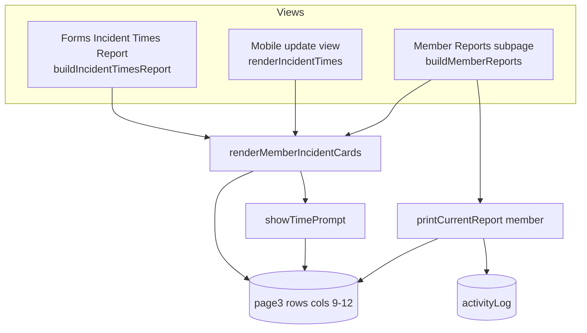

# Requirements

### Overview & Goals
Unify how incident timecards are displayed and edited so the **Incident Times Report** on the Forms page (`page5.html`) behaves exactly like the mobile update view (`mobile-status.html`) and the Member Reports subpage (`page3.html`). Additionally, let the Member Reports subpage print the member's incident timecards in addition to their activity log.

### Scope
#### In Scope
- Rebuild the Forms-page Incident Times Report to list each member with their editable **incident cards** (backed by personnel rows in `page3`, columns 9–12: Enroute / On Scene / Returning / Arrived Home), reusing the same `renderMemberIncidentCards` interaction used by mobile and member-report views.
- Editing a timecard on the report opens the same `showTimePrompt` popup and writes to `page3` — identical to the other two views.
- Update the Forms toolbar (`Add Row`, `Print Report`) and `printIncidentTimesReport()` so the printed output renders the card layout cleanly.
- Add an incident-timecards table to the Member Reports **Print** output (`printCurrentReport('member')`), placed **before** the activity log.

#### Out of Scope
- Changing the mobile update view or the Member Reports subpage on-screen behavior (they already work; they are the reference).
- Including timecards in **Print All Member Reports** (`printAllReports`) — not requested.
- Changing the underlying `page3` data schema.

### User Stories
- As an incident commander, I want to see every member and their incident timecards on the Forms-page Incident Times Report so I can review and edit times in one place.
- As a user, I want to edit those timecards on the report exactly the way I do in the mobile view or Member Reports subpage, so the experience is consistent and edits persist to the same data.
- As a user, I want the Member Reports Print to include the selected member's incident timecards along with their activity, so a single printout is complete.

### Functional Requirements
- The Forms → Incident Times Report shows a section per member (from `page3`) containing that member's incident-set cards plus the existing "Add Incident Row" affordance.
- Tapping a time slot opens `showTimePrompt` with a Clear option; saving/clearing updates `page3` columns 9–12 and re-renders — matching `renderMemberIncidentCards`.
- The `Print Report` button produces a printout that displays the incident cards (delete/add controls hidden via existing `.no-print`).
- The Member Reports `Print` button outputs the member's incident timecards table first, then the existing activity log.

# Technical Design

### Current Implementation
- **Forms Incident Times Report** — `buildIncidentTimesReport()` (`app.js` ~line 9067) builds a single `<table>` inside `#interactive-form-container` by **parsing `bundle.activityLog`** status-change messages into per-member sessions (Enroute/On-Scene/Leave-Scene/Home-Hotel). Cells are edited via `editIncidentTimestamp(logId)` which mutates activity-log entries. Toolbar (`app.js` ~line 8972) wires `Add Row` → `addIncidentRow()` (adds an activity-log entry) and `Print Report` → `printIncidentTimesReport()` (~line 9000, clones `#interactive-form-container` HTML into a print window).
- **Reference views (already correct)** — `renderMemberIncidentCards(memberName, container)` (`app.js` ~line 6615) renders `.incident-card` blocks from `page3` rows (cols 9=Enroute, 10=On Scene, 11=Returning, 12=Arrived Home), edited via `showTimePrompt`, with an "Add Incident Row" placeholder. The mobile view (`mobile-status.html` → `renderIncidentTimes` ~line 228) and Member Reports subpage (`buildMemberReports` → line 6812) both delegate to it.
- **Member Reports print** — `printCurrentReport('member')` (`app.js` ~line 6369) filters `activityLog` for the selected member and prints only the activity log.
- CSS for cards (`.incident-times-container`, `.incident-card`, `.incident-times-grid`, `.time-slot`, `.add-card-placeholder`) already exists in `styles.css`.

### Key Decisions
- **Reuse `renderMemberIncidentCards` for the Forms report** (confirmed with user). The report becomes a page3-backed, card-based view so edits are identical to the mobile and member-report views. The activity-log-derived table (`buildIncidentTimesReport` body, `editIncidentTimestamp`, `addIncidentTimestamp`) is retired for this view.
- **Member Reports print: timecards table first, then activity** (confirmed). Only the single-member `printCurrentReport('member')` is changed; `printAllReports` is left unchanged.

### Proposed Changes
1. **Rebuild `buildIncidentTimesReport()`** to iterate unique member names from `bundle.pages.page3`, and for each render a labeled section `
` and call `renderMemberIncidentCards(name, sectionContainer)` into it. Show an empty-state message when the roster has no members. Keep everything inside `#interactive-form-container`.
2. **Adjust the Forms toolbar** (`incident-times` branch): repurpose `Add Row` (`addIncidentRow`) to add an incident set / include a member via the existing member-picker (still writing to `page3`), or keep it as-is if it already targets page3-based flow; ensure `Print Report` still calls `printIncidentTimesReport()`.
3. **Update `printIncidentTimesReport()`** print CSS to style the card layout (`.incident-card`, `.incident-times-grid`, `.time-slot`) for print, relying on existing `.no-print` to hide delete/add buttons.
4. **Extend `printCurrentReport('member')`** to build an incident-timecards table (from the selected member's `page3` rows, cols 9–12) and inject it into the print HTML **before** the activity-log block, with matching print styles.

### Data Models / Contracts
- Incident timecard fields live in `page3` rows: `[0]=name`, `[9]=Enroute`, `[10]=On Scene`, `[11]=Returning`, `[12]=Arrived Home`. No schema change.
- `renderMemberIncidentCards(memberName: string, container: HTMLElement)` — reused unchanged; safe to call multiple times with distinct containers.

### Components / File Structure
- `app.js` — `buildIncidentTimesReport()` (rewritten), Forms toolbar `incident-times` branch (~8972), `printIncidentTimesReport()` (~9000), `printCurrentReport()` (~6369). `renderMemberIncidentCards` reused unchanged.
- `page5.html` / `page3.html` — no structural change expected (`#interactive-form-container`, `#member-reports-body`, `#print-member-reports` already exist).
- `styles.css` — reused; print-specific card styles are inlined in the print windows.

### Architecture Diagram

### Risks
- Retiring the activity-log-derived report removes derived extras (Time-On-Scene duration, task-form override times, activity-linked row delete). Mitigation: acceptable per the "edit exactly like the other views" requirement; note if any of these should be preserved.
- `renderMemberIncidentCards` must render correctly when invoked once per member; verify no reliance on unique element IDs (it uses the passed container).

# Testing

### Validation Approach
Manually exercise the three views against the same data to confirm the Forms report edits the same `page3` rows as the mobile and member-report views, and that printing includes timecards.

### Key Scenarios
- Open Forms → Incident Times: each roster member appears with their incident cards; empty roster shows the empty-state message.
- Set/clear a time on a card in the Forms report; reopen the member in the mobile view and Member Reports subpage and confirm the same value is shown (shared `page3`).
- Click `Print Report` on Forms: printout shows the card layout without delete/add buttons.
- Select a member in Member Reports → `Print`: the timecards table appears first, followed by the activity log.

### Edge Cases
- Member with multiple incident sets (several `page3` rows) renders multiple cards in each view.
- Member with no incident times still appears with an "Add Incident Row" affordance.
- Print with popups blocked shows the existing alert.

### Test Changes
- Existing repo tests are Node scripts unrelated to this UI. No automated tests are expected to change; validation is manual in-browser.

# Delivery Steps

### ✓ Step 1: Rebuild the Forms Incident Times Report as per-member incident cards
The Forms → Incident Times view lists every roster member with their editable incident cards, backed by page3 and edited identically to the mobile/member-report views.

- Rewrite `buildIncidentTimesReport()` in `app.js` to clear `#interactive-form-container` and iterate unique member names from `bundle.pages.page3`.
- For each member, create a labeled section `
` (member name header) and call `renderMemberIncidentCards(name, sectionContainer)` into it.
- Render an empty-state message when the roster has no members.
- Remove/retire the activity-log-derived table logic and its helpers used only here (`editIncidentTimestamp`, session-parsing loop, `addIncidentTimestamp`) as they are superseded by the card interaction.

### ✓ Step 2: Update the Forms toolbar and Print Report for the card layout
The Forms toolbar and printed report work correctly with the new card-based view.

- In the `incident-times` toolbar branch (`app.js` ~line 8972), ensure `Add Row` operates on page3 (add an incident set / pick a member) and `Print Report` still calls `printIncidentTimesReport()`.
- Update `printIncidentTimesReport()` print CSS to style `.incident-card`, `.incident-times-grid`, and `.time-slot` for print output.
- Rely on existing `.no-print` classes so delete and "Add Incident Row" controls are hidden in the printout.

### ✓ Step 3: Add incident timecards to the Member Reports print output
Printing a member report outputs the member's incident timecards table first, then their activity log.

- Extend `printCurrentReport('member')` in `app.js` to gather the selected member's `page3` rows (cols 9-12: Enroute/On Scene/Returning/Arrived Home).
- Build an incident-timecards HTML table and inject it into the print document **before** the activity-log block.
- Add matching print styles for the timecards table; leave `printAllReports` unchanged.