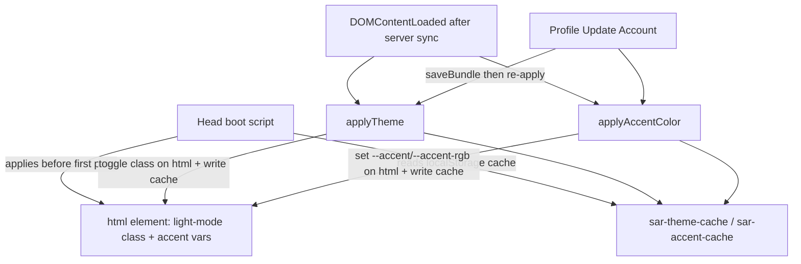

# Requirements

### Overview & Goals
The Light Mode + per-user highlight-accent feature was implemented previously, but three defects remain. This work fixes them:

1. **Highlight toggle has no visible effect** — turning on "Use My Highlight Color" does not recolor the UI (specifically while the site is in Light Mode).
2. **Profile "Update Account" doesn't apply the theme** — after choosing Light Mode in the profile editor (`page8`) and pressing **Update Account**, the screen stays in the old theme.
3. **Theme flash on load (FOUC)** — every page first renders in Dark Mode and then snaps to Light Mode a moment later, producing an unprofessional flash.

### Scope
**In Scope**
- Make the highlight-accent override actually win in Light Mode.
- Re-apply theme + accent immediately when the profile **Update Account** button is pressed.
- Eliminate the dark→light flash by applying the persisted theme/accent before first paint.

**Out of Scope**
- Changing the light palette colors, the highlight-color palette, or how users pick their highlight color.
- Any data-model/migration changes (existing `theme`, `color`, `useHighlightColor` fields stay as-is).

### User Stories
- As a user, when I enable "Use My Highlight Color", I want the accent to change everywhere immediately, even in Light Mode.
- As a user, when I select Light Mode in my profile and press Update Account, I want the site to switch to Light Mode right away.
- As a user, I want pages to open directly in my chosen theme with no dark-then-light flash.

### Functional Requirements
- Toggling **Use My Highlight Color** ON recolors all site-wide accent tints and the solid `--accent` in **both** Dark and Light Mode; OFF (or a `none`/white color) falls back to the default blue accent.
- Pressing **Update Account** in the profile editor persists and **immediately** applies the selected theme and highlight-accent preference.
- On page load, the last-known theme and accent are applied **before the first paint**, so there is no visible theme flash; the server-synced value still corrects the display if it differs.

# Technical Design

### Current Implementation
- **Theme class scope**: `applyTheme(bundle)` (`app.js` ~8440) adds/removes the `light-mode` class on **`document.body`**. The light palette lives in the `body.light-mode` block in `styles.css` (line 18), which redefines `--accent` and `--accent-rgb`.
- **Accent override**: `applyAccentColor(bundle)` (`app.js` ~8474) sets `--accent` / `--accent-rgb` inline on **`document.documentElement`** (`<html>`).
- **Init timing**: in `DOMContentLoaded` (`app.js` ~11846) the code `await`s `loadServerSettings()` (~11860) and `syncWithServer()` (~11877) **before** `applyTheme` / `applyAccentColor` run (~11881-11882) — i.e. seconds after the first paint.
- **Profile editor**: `buildUserAccountPage()` (`app.js` ~13678); the Light/Dark preview buttons call `applyTheme(bundle)` (~13829/13835), but the `save-user-btn` handler (~13855) calls `saveBundle` + `setCurrentUser` and does **not** re-apply theme/accent.

### Root Cause Analysis
- **Bug 1 — toggle does nothing in Light Mode (CSS custom-property scoping).** `body.light-mode` defines `--accent-rgb` **on `<body>`**, while `applyAccentColor` writes the override **on `<html>`**. For all visible content, `<body>` is the closer ancestor, so its `light-mode` value shadows the `<html>` inline override → the highlight color never applies in Light Mode. (In Dark Mode it works, because `<body>` doesn't redefine the var.)
- **Bug 2 — profile Update Account.** The `save-user-btn` handler never calls `applyTheme` / `applyAccentColor`, so the chosen theme isn't applied on save.
- **Bug 3 — FOUC.** Theme/accent are applied only after the awaited server round-trips in `DOMContentLoaded`; there is no synchronous, pre-paint theme application, and the theme lives in the server bundle (not available before first paint).

### Key Decisions
- **Move the `light-mode` class to `<html>` (`document.documentElement`) and target `html.light-mode` in CSS.** This makes the inline `--accent`/`--accent-rgb` override on `<html>` win over the class-level palette (inline beats class), fixing Bug 1, and lets a `<head>` boot script apply the theme before `<body>` is parsed (needed for Bug 3). Only one CSS selector uses `body.light-mode`, so the change is contained.
- **Persist a lightweight theme/accent cache in `localStorage`.** `applyTheme` / `applyAccentColor` write the resolved theme (`'light'`/`'dark'`) and accent (hex + rgb triple, or a default sentinel) to `localStorage`. A tiny synchronous boot snippet in each page's `<head>` reads that cache and applies the class + inline vars before first paint. The server sync still runs afterward and corrects the display if it differs.
- **Re-apply on Update Account.** The `save-user-btn` handler calls `applyTheme` + `applyAccentColor` after saving so the profile change takes effect immediately.

### Proposed Changes
1. **`styles.css`**: change the selector `body.light-mode` → `html.light-mode` (palette values unchanged).
2. **`app.js` — `applyTheme`**: toggle the `light-mode` class on `document.documentElement` instead of `document.body`; write the resolved theme to `localStorage` (`sar-theme-cache`).
3. **`app.js` — `applyAccentColor`**: keep setting `--accent`/`--accent-rgb` on `document.documentElement` (now authoritative over `html.light-mode`); write the resolved accent to `localStorage` (`sar-accent-cache`) when active, or clear the key + inline props on fallback.
4. **`app.js` — profile save**: in the `save-user-btn` onclick (`buildUserAccountPage`, ~13855), after `saveBundle`/`setCurrentUser`, call `applyTheme(bundle)` and `applyAccentColor(bundle)`.
5. **Early theme boot**: add an identical synchronous inline `<script>` in the `<head>` of each app HTML page (`index.html`, `home.html`, `settings.html`, `page2.html`–`page8.html`, `page10.html`, `more.html`, `mobile-status.html`) that reads `sar-theme-cache`/`sar-accent-cache` and applies the `light-mode` class + accent vars to `document.documentElement` before the body renders.

### Data Models / Contracts
```js
// localStorage cache (new; persists across reloads to kill FOUC)
'sar-theme-cache'  = 'light' | 'dark'
'sar-accent-cache' = '<hex>|<r, g, b>'   // e.g. '#800080|128, 0, 128'; absent => default blue

// early boot snippet (inline in each page <head>), pseudocode:
(function () {
  try {
    var t = localStorage.getItem('sar-theme-cache');
    if (t === 'light') document.documentElement.classList.add('light-mode');
    var a = localStorage.getItem('sar-accent-cache');
    if (a) {
      var p = a.split('|');
      document.documentElement.style.setProperty('--accent', p[0]);
      document.documentElement.style.setProperty('--accent-rgb', p[1]);
    }
  } catch (e) {}
})();
```

### File Structure
- `styles.css` — one selector change (`body.light-mode` → `html.light-mode`).
- `app.js` — `applyTheme` class target + cache write; `applyAccentColor` cache write; profile `save-user-btn` re-apply.
- HTML pages — add the identical `<head>` boot snippet.

### Architecture Diagram


### Risks
- **Stale cache after user switch**: the cache reflects the last-applied user; the `DOMContentLoaded` server sync re-applies the correct value, so at worst there is a brief correction on the first load after switching users.
- **Other `body.light-mode` references**: verified only one exists (the CSS definition); grep after the change to confirm none remain.
- **localStorage unavailable**: the boot snippet is wrapped in try/catch, so failure simply falls back to the current post-sync behavior.

# Testing

### Validation Approach
Manual in-browser verification across representative pages (Settings, Regions/index, Segments, Forms, profile `page8`), plus `node --check app.js` for syntax. Confirm behavior in both Dark and Light Mode, on toggle, on Update Account, and on reload.

### Key Scenarios
- **Highlight toggle in Light Mode**: with Light Mode active and a distinct highlight color, turning the toggle ON recolors nav hover/active, focus rings, buttons, and `.form-section` tints; turning it OFF reverts to the default blue.
- **Highlight toggle in Dark Mode**: still works as before (no regression).
- **Profile Update Account**: select Light Mode in `page8`, press Update Account → the site switches to Light Mode immediately and the choice persists.
- **No FOUC**: reload several pages while in Light Mode → each opens directly in Light Mode with no dark flash.

### Edge Cases
- Highlight color `none`/`white` with toggle ON → default blue fallback in both modes.
- No logged-in user → no crash; boot snippet + fallback apply defaults.
- localStorage cleared/unavailable → first load may briefly correct after sync, then behaves normally.
- Confirm no `body.light-mode` references remain after the selector change.

### Test Changes
No automated theming tests exist in the repo; validation is manual plus `node --check app.js`.

# Delivery Steps

### ✓ Step 1: Fix the highlight accent so it applies in Light Mode
Turning on "Use My Highlight Color" recolors the whole UI in both Dark and Light Mode.

- In `styles.css`, change the selector `body.light-mode` → `html.light-mode` (palette values unchanged) so the light theme now keys off the `<html>` element.
- In `app.js` `applyTheme(bundle)` (~8454), toggle the `light-mode` class on `document.documentElement` instead of `document.body`.
- Confirm `applyAccentColor(bundle)` (~8474) continues setting `--accent`/`--accent-rgb` inline on `document.documentElement`; because inline styles beat the `html.light-mode` class rule, the highlight override now wins in Light Mode too.
- Grep to confirm no `body.light-mode` references remain and run `node --check app.js`.

### ✓ Step 2: Apply theme & accent when the profile "Update Account" button is pressed
Selecting Light Mode (or a highlight preference) in the profile editor and pressing Update Account switches the screen immediately.

- In `buildUserAccountPage()` (`app.js` ~13855), inside the `save-user-btn` onclick, after `saveBundle(bundle)` and `setCurrentUser(...)`, call `applyTheme(bundle)` and `applyAccentColor(bundle)`.
- Verify the Light/Dark preview buttons still preview correctly and that the saved theme/accent stays applied after the save completes.

### ✓ Step 3: Eliminate the dark→light theme flash on page load
Pages open directly in the user's chosen theme with no visible dark-then-light flash.

- In `app.js`, have `applyTheme` write the resolved theme to `localStorage` (`sar-theme-cache`) and `applyAccentColor` write/clear the resolved accent (`sar-accent-cache`, format `'<hex>|<r, g, b>'`).
- Add an identical small synchronous inline `<script>` in the `<head>` of each app HTML page (`index.html`, `home.html`, `settings.html`, `page2.html`–`page8.html`, `page10.html`, `more.html`, `mobile-status.html`) that reads those keys and, before the body renders, adds the `light-mode` class and sets `--accent`/`--accent-rgb` on `document.documentElement` (wrapped in try/catch).
- Verify reloading several pages in Light Mode shows no flash, and that the post-sync `DOMContentLoaded` call still corrects the theme if the cache is stale.