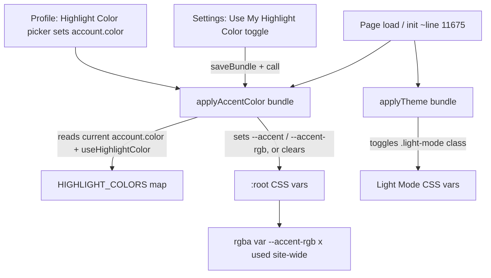

# Requirements

### Overview & Goals
The user Settings page currently offers a theme toggle labelled **Dark Mode / Grey Mode**. The "Grey Mode" is broken — it applies a class (`body.light-mode`) whose CSS variables are still dark grey, so nothing meaningfully lightens. This work:

1. **Converts "Grey Mode" into a real "Light Mode"** — selecting it puts the whole site into a genuine light theme (light backgrounds, dark text, lighter background-image dimming).
2. **Adds a per-user "Use My Highlight Color" toggle** — when ON, the site-wide semi-transparent accent color (used across nav, focus states, buttons, form sections, etc.) becomes a semi-transparent version of the highlight color that user picked in their profile.

### Scope
**In Scope**
- Restyle `body.light-mode` in `styles.css` into a true light palette.
- Rename all user-facing "Grey Mode" text to "Light Mode" (Settings page + profile editor).
- Refactor the ~35 hardcoded `rgba(125, 198, 255, x)` accent values in `styles.css` to a CSS variable so the accent can be recolored dynamically.
- Add a new **Use My Highlight Color** toggle to the Settings Theme area, stored per-user.
- Apply the user's highlight color as the site accent on page load and when toggled.

**Out of Scope**
- Changing how users pick their highlight color (the existing profile color picker stays as-is).
- Adding new highlight colors to the palette.
- Any data migration (the stored theme value stays `'light'`; only its meaning/appearance changes).

### User Stories
- As a user, I want the second theme option to actually produce a light-themed site so I can use the app comfortably in bright environments.
- As a user, I want to turn on a toggle that recolors the app's accent/highlight tint to my personal highlight color, so the interface feels personalized.
- As a user, I want that toggle to safely fall back to the default blue accent when it's off (or when my color is `none`/white), so the UI never becomes unreadable.

### Functional Requirements
- The Theme toggle shows **Dark Mode** / **Light Mode** (no more "Grey Mode" anywhere).
- Selecting Light Mode applies a light background, dark text, light panels/cards, and lighter background-image dimming across every page.
- A new **Use My Highlight Color** toggle appears in Settings.
  - The setting is stored on the current user's account (per-user), consistent with the per-user Highlight Color and Theme preferences.
  - When ON and the user's highlight color is a usable color, all site-wide semi-transparent accent tints and the solid `--accent` become that color.
  - When OFF, or the highlight color is `none` or white, the accent falls back to the existing default blue theme accent.
- Changes take effect immediately on toggle and persist across reloads/devices (saved into the data bundle like other settings).

# Technical Design

### Current Implementation
- **Theme variables** live in `styles.css`: `:root` (dark) at lines 1-15 and `body.light-mode` at lines 17-31. The `light-mode` block currently holds dark-grey values, which is why "Grey Mode" looks broken.
- **Theme application**: `applyTheme(bundle)` (`app.js` ~8390) resolves the theme from the logged-in account (`account.theme`) and toggles the `light-mode` class on `<body>`. It's called during init at `app.js` ~11675 alongside `applyBackground` / `applyTipsVisibility`.
- **Settings wiring**: `buildSettingsPage()` (`app.js` ~8430) wires `#theme-toggle` / `#theme-label` (lines 8510-8522), currently writing `bundle.theme` and labelling the ON state "Grey Mode".
- **Profile editor**: `app.js` ~13549-13630 renders per-user **Theme Preference** buttons (`Dark Mode` / `Grey Mode`, line 13553) and a **Highlight Color** picker that writes `account.color` (a key of `HIGHLIGHT_COLORS`, defined at `app.js` ~1536).
- **Accent color**: solid accent is the `--accent` CSS var; the semi-transparent accent tint is **hardcoded** as `rgba(125, 198, 255, x)` in ~35 places in `styles.css` (nav hover/active, `.pill-cell:focus`, `.add-col-btn-inline`, `.pill-checkbox:checked`, `.form-section`, `.form-input:focus`, etc.), so it cannot currently be recolored from JS.

### Key Decisions
- **Light Mode reuses the existing `light` theme value and `light-mode` class** — only the CSS variable values are rewritten to a real light palette. No data migration; existing users with `theme: 'light'` simply start seeing a proper light theme. (User confirmed: full light theme incl. lighter background dimming.)
- **Highlight toggle is per-user** — stored as `account.useHighlightColor` on the account object, matching how `account.theme` and `account.color` already work. (User confirmed.)
- **Accent recoloring via CSS variables** — introduce `--accent-rgb` (an `R, G, B` triple) in `:root` and replace hardcoded `rgba(125, 198, 255, x)` with `rgba(var(--accent-rgb), x)`. A JS helper overrides `--accent` and `--accent-rgb` on `document.documentElement` when the toggle is on. This recolors all ~35 semi-transparent usages plus solid accent in one place.
- **Safe fallback** — when the toggle is off, or the resolved highlight color is `none` or white (`#ffffff`), no overrides are set, so the default blue accent from CSS applies. (User confirmed: default blue accent fallback.)

### Proposed Changes
1. **`styles.css` — Light Mode palette**: rewrite `body.light-mode` variables to a true light theme, e.g. light `--glass`/`--glass-strong` (white-ish), dark `--text` (`#1a2230`-ish), muted dark `--muted`, light `--header-bg`, light `--pill-bg`/`--pill-border`, light `--popup-bg`, and lighter `--bg-dim-start`/`--bg-dim-end` (white-based overlay) so the fixed background image reads as light.
2. **`styles.css` — accent variable**: add `--accent-rgb: 125, 198, 255;` to `:root` (and an appropriate value in `body.light-mode` if needed); replace every hardcoded `rgba(125, 198, 255, x)` with `rgba(var(--accent-rgb), x)`.
3. **`app.js` — accent helper**: add `hexToRgbTriple(hex)` and `applyAccentColor(bundle)`. `applyAccentColor` resolves the current user (via `getCurrentUser()` + lookup in `bundle.accounts`), checks `account.useHighlightColor`, maps `account.color` through `HIGHLIGHT_COLORS`, and — if enabled and the color is usable — sets `--accent` and `--accent-rgb` on `document.documentElement`; otherwise clears those overrides.
4. **`app.js` — init**: call `applyAccentColor(bundle)` right after `applyTheme(bundle)` (~line 11675).
5. **`app.js` + `settings.html` — new toggle**: add a **Use My Highlight Color** toggle (`#highlight-accent-toggle` / `#highlight-accent-label`) to the Theme panel in `settings.html`; wire it in `buildSettingsPage()` to read/write `useHighlightColor` on the current user's account within the bundle, `saveBundle`, then `applyAccentColor`.
6. **Rename labels**: update the Theme panel copy in `settings.html` (line ~78), the ON-state label logic in `buildSettingsPage()` (lines 8512/8519) to "Light Mode", and the profile button text at `app.js` line 13553 (`Grey Mode` → `Light Mode`).

### Data Models / Contracts
```js
// account object (per-user, in bundle.accounts)
{
  username, pin, handle,
  theme: 'dark' | 'light',      // 'light' now means real Light Mode
  color: 'none' | 'orange' | ... // key of HIGHLIGHT_COLORS
  useHighlightColor: boolean     // NEW: apply personal accent when true
}

// helpers (app.js)
function hexToRgbTriple(hex): string        // '#7dc6ff' -> '125, 198, 255'
function applyAccentColor(bundle): void     // sets/clears --accent & --accent-rgb on :root
```

### Components / File Structure
- `styles.css` — light-mode palette rewrite; `--accent-rgb` var + replacement of hardcoded accent rgba values.
- `settings.html` — updated Theme panel copy + new highlight-color toggle markup.
- `app.js` — `applyAccentColor` / `hexToRgbTriple` helpers, init call, `buildSettingsPage` toggle wiring, and "Grey Mode" → "Light Mode" text updates.

### Architecture Diagram


### Risks
- **Missed hardcoded accent values**: any `rgba(125, 198, 255, ...)` left unconverted won't recolor — mitigate by grep-verifying zero remaining literals after the refactor.
- **Contrast in Light Mode**: light-mode `--accent-rgb` and text colors must keep readable contrast; verify focus/hover states remain visible.
- **White/none highlight**: guarded by the fallback so the accent never becomes invisible.

# Testing

### Validation Approach
Manual in-browser verification across a representative set of pages (Settings, Regions/index, Segments, Personnel, Forms, Home), since the app is a static multi-page site sharing `styles.css` and `app.js`. Confirm behavior on load, on toggle, and after reload (persistence).

### Key Scenarios
- **Light Mode on**: selecting Light Mode gives light backgrounds, dark readable text, light panels/cards, and a light-tinted background image on every page; label reads "Light Mode".
- **Dark Mode on**: reverts fully to the original dark theme.
- **Highlight toggle ON** with a distinct color (e.g. green/purple): nav hover/active, `.pill-cell:focus`, buttons, `.form-section`, and other accent tints all recolor to a semi-transparent version of that color; solid `--accent` text/borders match.
- **Persistence**: toggles survive a page reload and reflect on other pages (saved into the bundle per-user).
- **Combined**: Light Mode + custom highlight color together render correctly (no unreadable combos).

### Edge Cases
- Highlight color = `none` or `white` with toggle ON → accent falls back to default blue.
- Toggle OFF → default blue accent regardless of stored color.
- No logged-in user / Super Admin default → no crash; default accent used.
- Confirm (via search) that no `rgba(125, 198, 255, ...)` literals remain in `styles.css` after refactor.

### Test Changes
No automated test framework covers CSS/theming here; existing Node test scripts in the repo are unrelated (sync/proxy). No new automated tests planned — validation is manual as above.

# Delivery Steps

### ✓ Step 1: Convert Grey Mode into a real Light Mode
Selecting the second theme option renders the whole site in a genuine light theme, and no user-facing text says "Grey Mode".

- Rewrite the `body.light-mode` block in `styles.css` (lines ~17-31) to a true light palette: light `--glass`/`--glass-strong`, dark `--text`, dark-muted `--muted`, light `--header-bg`, light `--pill-bg`/`--pill-border`/`--pill-focus`, light `--popup-bg`, and lighter `--bg-dim-start`/`--bg-dim-end` so the fixed background image reads light.
- Update the Theme panel description in `settings.html` (line ~78) from "Dark Mode and Grey Mode" wording to Light Mode.
- Update `buildSettingsPage()` in `app.js` (lines 8512 & 8519) so the theme label shows "Light Mode" instead of "Grey Mode".
- Update the profile editor button text in `app.js` (line 13553) from "Grey Mode" to "Light Mode".
- Keep the stored theme value as `'light'` and the `light-mode` class name (no data migration).

### ✓ Step 2: Refactor the site-wide accent tint into a CSS variable
All semi-transparent accent styling reads from a single CSS variable so the accent can be recolored dynamically.

- Add `--accent-rgb: 125, 198, 255;` to `:root` in `styles.css` (and a suitable value under `body.light-mode` if needed for contrast).
- Replace every hardcoded `rgba(125, 198, 255, x)` occurrence (~35, e.g. nav hover/active, `.pill-cell:focus`, `.add-col-btn-inline`, `.pill-checkbox:checked`, `.form-section`, `.form-input:focus`) with `rgba(var(--accent-rgb), x)`.
- Verify via search that no `rgba(125, 198, 255, ...)` literals remain.

### ✓ Step 3: Apply the user's highlight color as the site accent
On load, the site accent reflects the logged-in user's highlight color when their per-user toggle is enabled, with a safe default fallback.

- Add a `hexToRgbTriple(hex)` helper in `app.js` that converts a hex color to an `R, G, B` string.
- Add `applyAccentColor(bundle)` in `app.js` that resolves the current account (`getCurrentUser()` + lookup in `bundle.accounts`), reads `account.useHighlightColor` and `account.color`, maps the color via `HIGHLIGHT_COLORS`, and sets `--accent` + `--accent-rgb` on `document.documentElement` — or clears them when the toggle is off or the color is `none`/white (default blue fallback).
- Call `applyAccentColor(bundle)` in the init flow right after `applyTheme(bundle)` (~line 11675).

### ✓ Step 4: Add the per-user "Use My Highlight Color" toggle to Settings
The Settings Theme area has a toggle that turns the personal highlight accent on/off per user, taking effect immediately and persisting.

- Add a new toggle-switch panel row in `settings.html` (in/near the Theme panel) with `#highlight-accent-toggle` and `#highlight-accent-label`.
- Wire it in `buildSettingsPage()` (`app.js`): initialize from the current user's `account.useHighlightColor`; on change, update that account within the bundle, `saveBundle(...)`, call `applyAccentColor(...)`, update the label, and set the status message.
- Ensure the toggle updates the accent live and the choice persists across reloads.