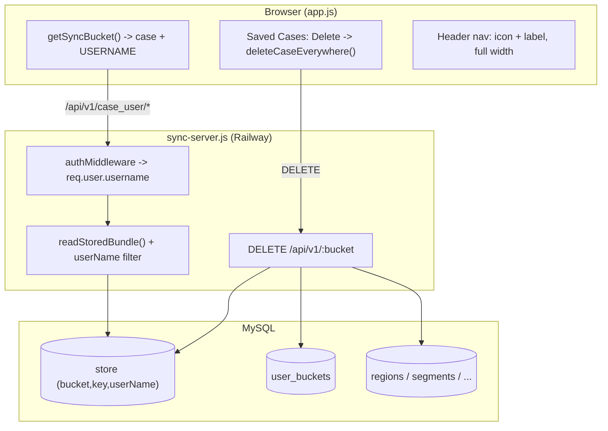

# Requirements

### Overview & Goals
Three independent fixes to the SAR web app, driven by the current behavior found in the code:

1. **Per-user data isolation** — the app must only show data belonging to the login that is currently authenticated. Today the sync *bucket* is namespaced by the shared **PIN** (`getSyncBucket()` returns `case_<pin>`), so any two logins that share a PIN land in the same bucket and see each other's data (leaking through the server read paths that don't filter by user).
2. **Deletable corrupt files** — a search file/case must be deletable even when it is corrupt and cannot be loaded back into the app. Today the *Delete* button refuses to act unless the case is cached and loadable, and it only deletes the local copy (never the server), so the case reappears on the next sync.
3. **Header layout** — in desktop mode the header must span the full screen width (not the 1200px container), and each page-navigation button must show its **icon and page title together** inside one button (today they are icon-only with the title only in a tooltip).

### Scope
**In scope**
- Namespacing synced data per **login username** instead of the shared PIN (client), plus server-side hardening so reads/writes are scoped to the authenticated user.
- A new server endpoint + client flow to **permanently delete a whole case** (store data + case history + structured rows) regardless of whether it loads.
- CSS/markup changes to make the desktop **header full-width** and to render **icon + label** nav buttons across all pages.

**Out of scope**
- No data **migration** of pre-existing PIN-bucketed data — new per-user spaces start fresh (per decision). Old rows stay in the DB but are no longer surfaced.
- Changing the login/auth model, roles, or the Super-Admin (PIN `1976`) protection rules.
- The legacy `data.php` PHP backend is not the active backend (the app targets the Node `sync-server.js`); mirroring the delete endpoint there is optional/nice-to-have.
- Redesigning the mobile `bottom-nav` (it already shows icon + label).

### User Stories
- As a logged-in user, I want to see **only my own** regions/segments/personnel/etc., so another login (even one sharing my PIN) never sees or overwrites my data.
- As a user with a **corrupt/unloadable** case, I want to delete it permanently so it stops cluttering my Saved Cases and doesn't resync back.
- As a desktop user, I want the header to use the **full screen width** and show **page names next to the icons**, so navigation is clearer and less cramped.

### Functional Requirements
- **FR1 (isolation):** All synced reads/writes are scoped to the authenticated username. Two logins with different usernames never see each other's cases, even if they share a PIN or a CASE #.
- **FR2 (fresh start):** After the change, a user's Saved Cases list shows only cases stored under their own (username) namespace; stale PIN-namespaced entries are not shown.
- **FR3 (delete anything):** The Delete action on Saved Cases works for any listed case, including ones that are not cached locally or fail to parse; it does not require loading the case first.
- **FR4 (permanent):** Deleting a case removes it from the server (stored data + case history + structured tables) and from local cache, so it does not reappear on the next sync.
- **FR5 (permissions preserved):** Existing permission gates (admin/file-manager, delete-mode/confirm, Super-Admin file protection) still apply.
- **FR6 (full-width header):** In desktop mode the header content stretches edge-to-edge (with sensible padding); the main content/footer container stays at its current width.
- **FR7 (labeled nav):** Each desktop page-navigation button shows its icon and the page title together inside the same button, on every page.

### Non-Functional Requirements
- **Compatibility:** Bucket suffix derived from the username must be URL-safe (usernames may contain spaces) so API paths remain valid.
- **Consistency:** The nav must remain identical across all HTML pages (it is generated centrally by `update_nav.ps1`).
- **No regressions:** Same-login multi-device real-time sync must keep working (same username -> same bucket); the mobile bottom-nav and `<=860px` header-hiding behavior must be unaffected.

# Technical Design

### Current Implementation
**Backend — `sync-server.js` (Node/Express, MySQL; the active backend on Railway):**
- `store` table PK is `(bucket, key)` with a `userName` column (line 315). Because the PK does not include `userName`, a shared bucket physically holds **one row per key** (last-writer-wins via `INSERT OR REPLACE`).
- User-scoped reads exist for `GET /latest` (1040), `GET /:key` (1054), `GET /all-files` (1026) and `DELETE /:key` (1069) — all filter by `req.user.username`.
- **Gaps:** `readStoredBundle()` (~923) used by `POST /:bucket/rows` (935) and `GET /:bucket/page/:page` (1003) does **not** filter by `userName`; the `PUT /:key` conflict lookup (1122) queries `(bucket, key)` without `userName`.
- History lives in `user_buckets` `(username, bucket)` (325); structured data lives in `COLLECTION_TABLES`/`SINGLE_TABLES` keyed by `(username, search_case)` (396-411), written by `decomposeBundleToTables()` on every PUT (1159).
- `DELETE /:bucket/:key` deletes **only one store key**; it never touches `user_buckets` or the structured tables.

**Frontend — `app.js`:**
- On login, cookies store username and **PIN** (`USER_PASSWORD_STORAGE_KEY = pin`, lines 998-999); `getUserCredentials()` returns `{name, password:pin}`.
- `getSyncBucket()` (740-758) returns `` `${bucket}_${creds.password}` `` -> **case + PIN**. `bucketToCaseNumber()` (775-783) strips that `_<pin>` suffix. These are the **only** two places that build the suffix.
- `buildSavedFilesTable()` (7627-7816) merges server history (`fetchUserHistory()` -> `/api/auth/history`) with locally-cached bundles. The **Delete** button (7772-7796) blocks when `!hasLocal` ("open it (Load) before deleting", 7780-7783) and calls only `deleteFileFromList()` (2305-2311), a local-only delete. The sync loop (`syncWithServer` 14252+, `all-files` reconcile 14291-14318) re-adds any file present on the server -> local deletes don't stick.

**Header/nav — `styles.css` + `update_nav.ps1` + all `*.html`:**
- `header` is full-width, but `.nav-wrap` caps content at `max-width:1200px; margin:0 auto` (58-67), matching `main`. `nav a` (87-102) are icon-only pills; the title is only in the `title` attribute.
- The desktop `<nav>` and mobile `<nav class="bottom-nav">` are generated by `update_nav.ps1` (template lines 1-41) and duplicated into every HTML file. Desktop header is hidden `<=860px` where `bottom-nav` (icon + `<span>` label) shows (styles.css 735-739, 2885-2950).

### Key Decisions
- **Isolation = per-user bucket (chosen).** Namespace the bucket by **username** instead of PIN. Because `store`'s PK already includes `bucket`, a username-scoped bucket makes every row inherently user-specific and closes the `readStoredBundle`/PUT gaps by construction; same-login multi-device sync is preserved (same username -> same bucket).
- **No migration / start fresh (chosen).** Old `_<pin>` rows are left untouched in the DB but hidden; the client filters history to the current user's suffix so orphaned cases don't appear.
- **Permanent, server-side delete (chosen).** A new whole-bucket delete endpoint removes store rows + `user_buckets` history + structured rows for the user, so deleted cases can't resync back. Delete no longer requires a loadable/cached bundle.
- **Defense-in-depth server hardening.** Even though the per-user bucket fixes the leak, add `userName` filters to `readStoredBundle()`, `/page`, `/rows`, and the PUT conflict lookup to match the documented "scoped to the authenticated login" intent.
- **Header full-width via `.nav-wrap` only.** Widen the header container but leave `main`/`footer` at 1200px, since only the header is requested to go full-width.

### Proposed Changes
**Part 1 — Per-user isolation (`app.js`, `sync-server.js`)**
- `getSyncBucket()`: build the suffix from a **URL-safe username** (e.g. `encodeURIComponent(creds.name)` or a consistent sanitizer) instead of `creds.password`.
- `bucketToCaseNumber()`: strip the same username-based suffix. Add `caseNumberToBucket(caseNumber)` returning `` `${caseNumber}_${suffix}` `` for Load/Delete callers.
- `buildSavedFilesTable()` history merge (7655-7660): skip history buckets whose suffix != the current user's suffix (fresh start).
- Server hardening: add `AND userName = ?` to `readStoredBundle()` (923) and the `/page` (1003) & `/rows` (935) queries, and include `userName` in the `PUT` conflict lookup (1122).

**Part 2 — Permanent case deletion (`sync-server.js`, `app.js`)**
- New route `DELETE /api/v1/:bucket` (authed): for `req.user.username`, delete from `store` where `(bucket, userName)`; delete the `user_buckets` `(username, bucket)` row; delete `(username, search_case = case #)` from every `STRUCTURED_TABLES`. Keep Super-Admin (`1976`) protection.
- New client helper `deleteCaseEverywhere(caseNumber)`: call the endpoint with `getAuthHeaders()` using `caseNumberToBucket(caseNumber)`, then `deleteFileFromList()` and clear any cached/active bundle for that case.
- Delete button (7772-7796): drop the `!hasLocal` guard; call `deleteCaseEverywhere()`; keep permission + delete-mode/confirm; handle deleting the active case (reset active bundle/sync bucket) and rebuild the table.

**Part 3 — Header (`styles.css`, `update_nav.ps1`, all `*.html`)**
- `.nav-wrap`: `max-width:none` (+ horizontal padding); revisit the 33%/66% split so brand + wider nav lay out across full width.
- `update_nav.ps1` `$navTemplate`: add `<span class="nav-label">Title</span>` beside each page icon; regenerate all pages (or hand-edit each `<nav>`).
- `nav a`: `display:inline-flex; align-items:center; gap:8px;` + `.nav-label` styles (nowrap). Profile avatar & notification bell stay icon-only (not pages).

### Data Models / Contracts
```
// Bucket id (client-derived)
bucket = `${caseNumber}_${urlSafe(username)}`   // was `${caseNumber}_${pin}`

// New endpoint
DELETE /api/v1/:bucket            (auth headers: X-User-Name, X-User-Pin/Password)
  -> 200 { success: true }
  -> 403 { error:'Conflict', message:'Cannot delete Super-Admin created files.' }
  effect (for req.user.username):
    DELETE FROM store        WHERE bucket=? AND userName=?
    DELETE FROM user_buckets WHERE username=? AND bucket=?
    for t in STRUCTURED_TABLES: DELETE FROM t WHERE username=? AND search_case=?

// New client helpers
caseNumberToBucket(caseNumber) -> `${caseNumber}_${urlSafe(username)}`
async deleteCaseEverywhere(caseNumber) -> DELETE + local cleanup
```

### Components
- **`getSyncBucket()` / `bucketToCaseNumber()` (app.js)** — change suffix source from PIN to username; add `caseNumberToBucket()`.
- **`buildSavedFilesTable()` (app.js)** — history filtering + rewired Delete button.
- **`syncWithServer()` (app.js)** — unchanged logic, but now scoped by the username bucket; verify deletions don't get re-added.
- **Store routes + `readStoredBundle()` (sync-server.js)** — userName-scoping + new whole-bucket delete route.
- **`.nav-wrap` / `nav a` (styles.css)** — full-width header + icon+label pills.
- **`update_nav.ps1` + all `*.html`** — nav template with labels, propagated to every page.

### File Structure
```
app.js            (M) getSyncBucket, bucketToCaseNumber, +caseNumberToBucket,
                      +deleteCaseEverywhere, buildSavedFilesTable delete button
sync-server.js    (M) readStoredBundle + /page + /rows + PUT userName scoping,
                      + DELETE /api/v1/:bucket route
styles.css        (M) .nav-wrap width, nav a layout, .nav-label
update_nav.ps1    (M) $navTemplate: icon + <span class="nav-label">
*.html            (M) regenerated <nav> (home,index,page2..8,page10,settings,more,...)
data.php          (optional) mirror whole-case delete if that backend is used
```

### Architecture Diagram


### Risks
- **URL-safety of usernames:** spaces/special chars in the username must be encoded consistently in both bucket-building functions and the API path, or requests 404. Mitigation: single `urlSafe()`/suffix helper used everywhere.
- **Stale history entries:** old `_<pin>` buckets remain in `user_buckets`; filter them out client-side so they don't clutter Saved Cases.
- **Structured `search_case` nuance:** the active working key is `bundle`; the delete endpoint should target the specific case #, not blindly delete `search_case='bundle'` (shared across cases).
- **Deleting the active case:** must reset the active bundle/sync bucket to avoid a broken current view.
- **Perceived data loss:** "start fresh" means existing shared-PIN data disappears from the UI; acceptable per decision, but worth confirming in release notes.

# Testing

### Validation Approach
Use the project's existing Node test pattern (`test_row_level_sync.js`, `test_row_sync_endpoint.js`, `test_sync_bucket_decoupling.js`, `test_structured_tables.js`) to script backend behavior against `sync-server.js`, and inspect DOM/CSS/markup for the header changes.

### Key Scenarios
- **Isolation:** Two logins with **different usernames but the same PIN** save under the same CASE #; each `GET /latest`, `/bundle`, `/page`, and `/rows` returns only that login's data (no cross-read). Same username on two devices still shares and merges.
- **Fresh start:** After switching the suffix to username, Saved Cases shows only current-username cases; old `_<pin>` entries are absent.
- **Delete corrupt case:** A case that isn't cached locally (or whose cached bundle fails to parse) can still be deleted; after delete it is gone from `all-files`, `/api/auth/history`, and all structured tables, and does **not** reappear after a sync cycle.
- **Permissions:** A non-Super-Admin cannot delete a Super-Admin (`1976`) case (still 403); delete-mode skips the confirm, otherwise confirm is required.
- **Header full width:** At a desktop width the header content spans edge-to-edge while `main` stays at 1200px.
- **Labeled nav:** Every desktop nav page-button contains an icon **and** its title text on every generated page; profile avatar and bell remain icon-only.

### Edge Cases
- Username with spaces/special characters -> bucket path stays valid (encoded) and round-trips through `bucketToCaseNumber()`.
- Deleting the **currently active** case resets the active bundle/sync bucket without errors.
- Deleting a case that exists only on the server (never cached) still succeeds.
- `<=860px`: desktop header hidden, bottom-nav shown, labels/full-width changes cause no layout break.
- Server offline during delete: user sees a failure and the case is not silently half-deleted (local removal only after server success, or clearly reconciled).

### Test Changes
- Add/extend a backend test for `DELETE /api/v1/:bucket` verifying store + `user_buckets` + structured-table cleanup and Super-Admin protection.
- Extend a bucket-scoping test to assert same-PIN/different-username isolation across `/latest`, `/page`, and `/rows`.
- Optional: a small DOM/CSS assertion (or manual checklist) confirming `.nav-label` presence and the full-width header.

# Delivery Steps

### ✓ Step 1: Scope all synced data to the logged-in username (per-user bucket)
Each login only reads/writes its own data because the sync bucket is namespaced by username instead of the shared PIN, with server-side scoping as backup.

- In `app.js`, change `getSyncBucket()` (~line 754) to append a URL-safe **username** suffix (e.g. `encodeURIComponent(creds.name)`) instead of `creds.password` (the PIN).
- Update `bucketToCaseNumber()` (~line 778) to strip the same username-based suffix, and add a `caseNumberToBucket(caseNumber)` helper (used by Load/Delete) that appends it; centralize the suffix in one helper so it stays consistent and URL-safe.
- In `buildSavedFilesTable()` history merge (~lines 7655-7660), ignore history buckets whose suffix does not match the current user's suffix, so orphaned `_<pin>` cases from before the change are not shown ("start fresh", no migration).
- Harden `sync-server.js` as defense-in-depth: add `AND userName = ?` to `readStoredBundle()` (~923) and to the `GET /:bucket/page/:page` (~1003) and `POST /:bucket/rows` (~935) queries, and include `userName` in the `PUT /:key` conflict lookup (~1122), matching the already user-scoped `/latest`, `/:key`, `/all-files`, and `DELETE` endpoints.
- Leave existing `_<pin>` rows in the DB untouched (no migration).

### ✓ Step 2: Enable permanent deletion of any case, including corrupt/unloadable ones
A user can delete any listed case regardless of whether it loads, and it does not come back on the next sync.

- Add an authenticated route `DELETE /api/v1/:bucket` in `sync-server.js` that, for `req.user.username`, deletes: all `store` rows for `(bucket, userName)`, the `user_buckets` row `(username, bucket)`, and rows in every `STRUCTURED_TABLES` for `(username, search_case = case #)`; preserve the existing Super-Admin (PIN `1976`) protection used by the current `DELETE /:key`.
- Add a client helper `deleteCaseEverywhere(caseNumber)` in `app.js` that calls the new endpoint (via `getAuthHeaders()` and `caseNumberToBucket()`), then removes the local copy with `deleteFileFromList()` and clears any cached/active bundle for that case.
- Rewire the Delete button in `buildSavedFilesTable()` (~lines 7772-7796) to call `deleteCaseEverywhere()`; remove the `!hasLocal` guard (lines 7780-7783) that blocks deleting non-loaded/corrupt cases; keep the permission check and delete-mode/confirm flow.
- Handle the edge case where the deleted case is the active bucket (reset active bundle / sync bucket) and rebuild the table afterward.
- (Optional) mirror the endpoint in `data.php` only if that backend is still deployed.

### ✓ Step 3: Make the desktop header span the full screen width
On desktop the header content stretches edge-to-edge instead of being capped at the 1200px container, while the page body stays contained.

- In `styles.css`, remove the `max-width: 1200px; margin: 0 auto;` cap from `.nav-wrap` (lines 58-67): set `max-width: none` and use horizontal padding for spacing; leave `main` and `footer` at 1200px so only the header goes full-width.
- Revisit the `33% / 66%` split (`.nav-wrap > div:first-child` and `nav`, lines 69-79) so the brand and the wider nav lay out well across the full width.
- Verify the `@media (max-width: 860px)` rules (lines 735-739) still hide the desktop header and show the mobile bottom-nav, with no layout break at the breakpoint.

### ✓ Step 4: Show each page's title inside its nav icon button
Every desktop nav page-button shows its icon and page name together inside one pill, consistently across all pages.

- Update the `$navTemplate` in `update_nav.ps1` (lines 1-16) so each page link contains its SVG icon plus a `<span class="nav-label">…</span>` with the page title (Home, Regions, Segments, Personnel, Search Log, Forms, Incident, Maps, Uploads, Users, Settings); keep the `title` attributes for accessibility.
- Regenerate the nav across all pages by running `update_nav.ps1` (updates home/index/page2-8/page10/settings/more/etc.), or hand-edit each file's `<nav>` block to match the new template.
- In `styles.css`, update `nav a` (lines 87-102) to `display: inline-flex; align-items: center; gap: 8px;` and add `.nav-label` styling (nowrap, appropriate size); leave the profile avatar (`#profile-btn`) and notification bell icon-only since they do not lead to a page.
- Confirm the mobile `bottom-nav` (already icon + label) is unaffected.