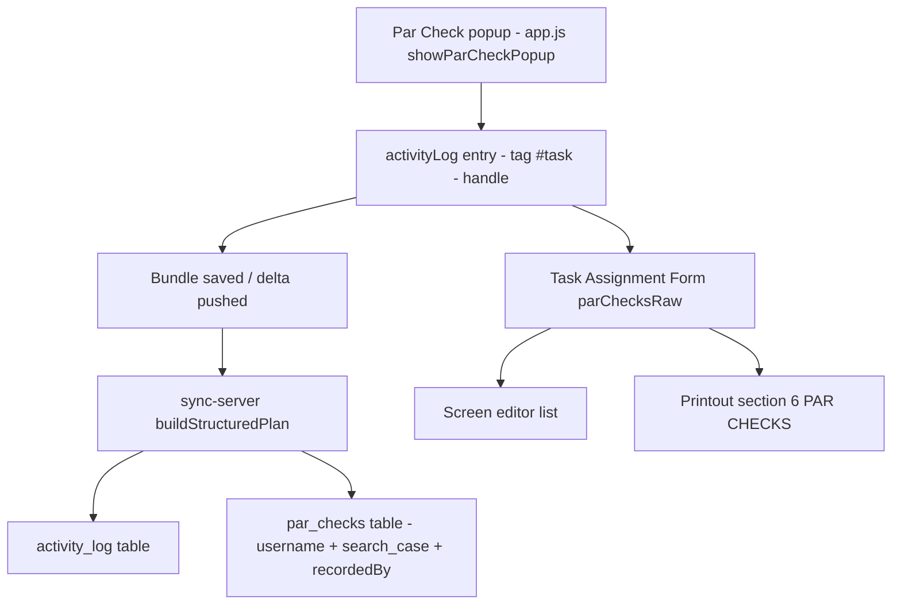

# Requirements

### Overview & Goals
Par checks (the 20-minute status check-ins entered from the home page team table) are currently captured only as free-text activity-log entries and an ephemeral, last-only timer object (`bundle.parChecks`). They are **not** persisted to the server database as first-class, queryable records stamped with the case number and the username who recorded them.

This change makes every manually recorded par check a durable record in the server's structured database, stamped with the **case number** and **username**, and ensures those par checks reliably appear on the **Task Assignment Form** screen editor and its **printout**.

### Scope
#### In Scope
- Persist par checks to a new structured `par_checks` table on the sync server, derived from the activity log, stamped with case number (`search_case`) + team username, and carrying the recorder's handle.
- Keep the **full history** of par checks (one record per manual par check), not just the latest.
- Ensure incremental (row-level) sync mirrors par checks into the new table whenever the activity log changes.
- Ensure par checks are shown on the Task Assignment Form screen editor and included on the printed task form.
- Extend the existing structured-table / row-sync unit tests to cover par checks.

#### Out of Scope
- Changing the source of par-check capture away from the activity log (per decision, par checks are **derived from the activity log**).
- Recording automatic/implicit par resets (status changes) as par checks — only **manual popup submissions** are recorded.
- Redesigning the par-check entry UI or the par-check-due timer logic.

### User Stories
- As an incident commander, I want every par check to be saved to the server database with its case number and the operator who logged it, so there is an auditable check-in history for each team.
- As a team leader, I want par checks to appear on the Task Assignment Form on screen and on the printout, so the 20-minute status history travels with the task record.

### Functional Requirements
1. When a user submits the Par Check popup, the par check is recorded as an activity-log entry tagged with the current task (`#<task>`) and the recording user's handle (existing behavior, hardened).
2. On save/sync, each par check becomes a row in the server `par_checks` table stamped with the team `username` and `search_case` (case number), and the row data preserves the recorder's handle, note text, task tag, date, and time.
3. Full history is retained — every manual par check produces its own row.
4. The Task Assignment Form screen editor lists all par checks for the selected task.
5. The printed Task Assignment Form includes a Par Checks section listing the same entries (time + action), or an explicit "No par checks recorded" note when none exist.
6. Par checks are readable back through the existing structured-table read endpoints (`/api/v1/tables` and `/api/v1/tables/par_checks`).

### Non-Functional Requirements
- Backward compatible: existing bundles without par checks continue to sync; empty par-check history yields an empty table, not an error.
- Consistent with existing structured-table conventions (per-`(username, search_case)` isolation).

# Technical Design

### Current Implementation
- **Capture** (`app.js`, `showParCheckPopup`, ~line 5150): writes `bundle.parChecks[teamName] = { lastTime, lastNote }` (last-only, no user/case, not mirrored to any table) and calls `addActivityLogEntry(teamName, "[HH:MM] Par Check: ...")`.
- **Activity log** (`app.js`, `addActivityLogEntry`, ~line 5650): unshifts an entry with `tag = "#<task> - <handle>"`, `team`, `members`, `action`, `date`, `time`, `timestamp`. This is synced as part of the bundle.
- **Form display / print** (`app.js`): `buildTaskAssignmentForm` / `renderTaskForm` (~10001) compute `formData.parChecksRaw` by filtering `bundle.activityLog` where `l.tag === '#'+taskNum || l.tag.startsWith('#'+taskNum+' - ')` and the action contains `par check`/`check-in` (~10116). The screen editor renders these (~10328) and `getTaskFormPrintHTML` prints them in section "6. PAR CHECKS" (~10758).
- **Server structured tables** (`sync-server.js`): `COLLECTION_TABLES` (~396) + `SINGLE_TABLES` (~408) define normalized tables; `buildStructuredPlan` (~434) turns a bundle into rows; `decomposeBundleToTables` (~493) and `applyChangesToTables` (~545) write them, always stamping `username` (team account) + `search_case` (CASE #, from `bundle.fileName`). There is **no** `par_checks` table.
- **Delta sync** (`sync-delta.js`): `LIST_TABLES` maps `activityLog → activity_log` (~43); `describeChangeTarget` (~231) maps a change to exactly one table. `bundle.parChecks` changes map to `{kind: 'none'}` (not mirrored).

### Key Decisions
- **Derive par checks from the activity log** (chosen): the server extracts par-check rows from `bundle.activityLog` rather than introducing a new client-side source-of-truth array. This keeps a single capture path and reuses the recorder/case/task metadata already present on each log entry.
- **Full history** (chosen): every par-check log entry becomes its own `par_checks` row.
- **Manual popup only** (chosen): only entries whose action denotes a manual par check/check-in are extracted; automatic status resets are ignored.
- **Stamping**: `username` = team sync account and `search_case` = CASE # are applied automatically by the existing decompose logic; the **recorder's handle** is parsed from the entry `tag` (` - <handle>`) and stored inside each row's `data`/`label` so the recording user is explicit.

### Proposed Changes
1. **`sync-server.js`**
   - Add `'par_checks'` to `COLLECTION_TABLES` so its table is created and exposed by the read endpoints (`STRUCTURED_TABLES`).
   - In `buildStructuredPlan`, add a `par_checks` collection derived from `bundle.activityLog`: filter entries recognized as par checks (action contains `par check`/`check-in`), and for each produce `{ label: <task tag or team>, data: { ...entry, caseNumber: searchCase, recordedBy: <handle parsed from tag> } }`. Empty/absent activity log yields an empty array.
   - Add a small helper (e.g. `isParCheckEntry(entry)` / `parseRecorderFromTag(tag)`) used by the plan builder.
2. **`sync-delta.js`**
   - Ensure changes to `activityLog` also refresh `par_checks`. Since `par_checks` is derived from the same source as `activity_log`, add logic so that when a change targets the activity log, both `activity_log` and `par_checks` are rebuilt. Implemented either by extending `describeChangeTarget`/`applyChangesToTables` in `sync-server.js` to add `par_checks` to the rebuild set whenever `activity_log` is affected.
3. **`app.js`**
   - Harden capture in `showParCheckPopup` so the recorded note always contains the matchable "Par Check" keyword and is tagged to the active task and current user (guard against empty/blank submissions still producing a valid, matchable entry).
   - Verify the Task Assignment Form filter (`formData.parChecksRaw`) and print section reliably capture all par checks for the selected task; adjust the matcher only if needed so par checks display on screen and print. Optionally surface the recorder handle in the on-screen row.

### Data Models / Contracts
`par_checks` follows the standard collection-table schema already created for all `COLLECTION_TABLES`:

```
par_checks (
  id INTEGER PRIMARY KEY AUTOINCREMENT,
  username    VARCHAR(191) NOT NULL,   -- team sync account
  search_case VARCHAR(191) NOT NULL,   -- CASE # (bundle.fileName)
  row_index   INTEGER,
  label       VARCHAR(255),            -- task tag (e.g. "#5") or team
  data        LONGTEXT,                -- JSON: { team, action, date, time, timestamp, tag, recordedBy, caseNumber }
  updatedAt   VARCHAR(64)
)
```

`buildStructuredPlan` addition (illustrative):
```js
const PAR_CHECK_RE = /par check|check-in/i;
const parseRecorderFromTag = (tag) => {
  const parts = String(tag || '').split(' - ');
  return parts.length > 1 ? parts.slice(1).join(' - ').trim() : '';
};
// inside collections:
par_checks: collection(
  (bundle.activityLog || []).filter(e => e && PAR_CHECK_RE.test(String(e.action || ''))),
  (e) => ({ label: (e.tag || '').split(' - ')[0] || e.team || '',
            data: { ...e, caseNumber: searchCase, recordedBy: parseRecorderFromTag(e.tag) } })
)
```

### Architecture Diagram


### Risks
- **Index shifts**: activity log entries are unshifted (prepended), shifting row indexes; par-check extraction must rebuild the whole `par_checks` collection on activity-log changes rather than attempting single-row upserts. Mitigated by rebuilding `par_checks` alongside `activity_log`.
- **Keyword matching**: relying on the `par check`/`check-in` substring must stay consistent between client capture and server extraction; centralize the keyword and keep the client note prefix stable.
- **Recorder handle absence**: entries without a ` - handle` tag yield an empty `recordedBy`; handled gracefully.

# Testing

### Validation Approach
Extend the existing Node-based unit/integration tests (run with `node <file>`) that already exercise the structured tables and row-level sync, then confirm the read endpoints expose the new table.

### Key Scenarios
- `buildStructuredPlan` produces a `par_checks` collection with one row per manual par-check activity-log entry, each row carrying `search_case` (case number) and `recordedBy` (username/handle) in its data.
- A bundle with par-check entries decomposes into `par_checks` rows stamped with the team `username` and CASE #.
- `/api/v1/tables` and `/api/v1/tables/par_checks` return the par-check rows filtered by `username` and `?case=`.
- The Task Assignment Form screen editor and printout list par checks for the selected task, and show the "No par checks recorded" state when none exist.

### Edge Cases
- Bundle with no activity log / no par checks → `par_checks` is an empty array, not an error (mirrors existing `empty collections` test).
- Non-bundle payloads (no `pages`) are still ignored.
- Entries without a recorder handle in the tag → `recordedBy` empty but row still created.
- Adding a new par check (unshift) shifts indexes → `par_checks` is rebuilt so it mirrors the latest history.

### Test Changes
- Extend `test_structured_tables.js`: add `par_checks` to the sample bundle's activity log and assert the derived collection, labels, `recordedBy`, and `caseNumber`; include it in the `all declared tables are represented` and `empty collections` checks.
- Extend `test_row_level_sync.js` (and/or `test_row_sync_endpoint.js`): assert that an activity-log change also refreshes the `par_checks` table.

# Delivery Steps

###   Step 1: Add server-side par_checks structured table derived from the activity log
The sync server produces and stores a `par_checks` table, one row per manual par check, stamped with case number and username.

- In `sync-server.js`, add `'par_checks'` to `COLLECTION_TABLES` so the table is auto-created and included in `STRUCTURED_TABLES` (and thus the read endpoints).
- Add helpers `isParCheckEntry(entry)` (matches `par check`/`check-in` in the action) and `parseRecorderFromTag(tag)` (extracts the ` - <handle>` recorder).
- In `buildStructuredPlan`, add a `par_checks` collection derived from `bundle.activityLog`, mapping each par-check entry to `{ label: task tag or team, data: { ...entry, caseNumber: searchCase, recordedBy } }`.
- Rely on existing `decomposeBundleToTables` to stamp each row with team `username` + `search_case`.

###   Step 2: Mirror par checks during incremental (row-level) sync
Par checks stay in sync via the delta path, not just full saves.

- In `sync-server.js` `applyChangesToTables`, ensure that whenever a change targets the activity log (`activity_log`), `par_checks` is added to the set of tables to rebuild (since par checks are derived from the same source and activity-log appends shift row indexes).
- Coordinate with `sync-delta.js` `describeChangeTarget`/`LIST_TABLES` so activity-log changes reliably trigger a `par_checks` rebuild.
- Guarantee the rebuilt `par_checks` reflects the full current history for the `(username, search_case)`.

###   Step 3: Harden par check capture and Task Assignment Form display/printout
Manual par checks are reliably recorded and shown on the task form screen editor and printout.

- In `app.js` `showParCheckPopup`, ensure every submission writes a matchable, task-tagged, user-stamped activity-log entry (stable "Par Check" prefix even when the note is blank).
- Verify/adjust `formData.parChecksRaw` computation in `buildTaskAssignmentForm`/`renderTaskForm` so all par checks for the selected task are captured on screen.
- Verify the printout section "6. PAR CHECKS" in `getTaskFormPrintHTML` lists the same entries (and the empty-state note when none), optionally surfacing the recorder handle on screen.

###   Step 4: Extend tests for par check persistence and sync
Automated tests cover the new table and its sync behavior.

- Extend `test_structured_tables.js`: add par-check entries to the sample bundle's activity log; assert the `par_checks` collection contents, labels, `recordedBy`, and `caseNumber`; include `par_checks` in the `all declared tables` and `empty collections` assertions.
- Extend `test_row_level_sync.js` and/or `test_row_sync_endpoint.js` to assert an activity-log change refreshes the `par_checks` table and that the read endpoint returns rows filtered by username and case.